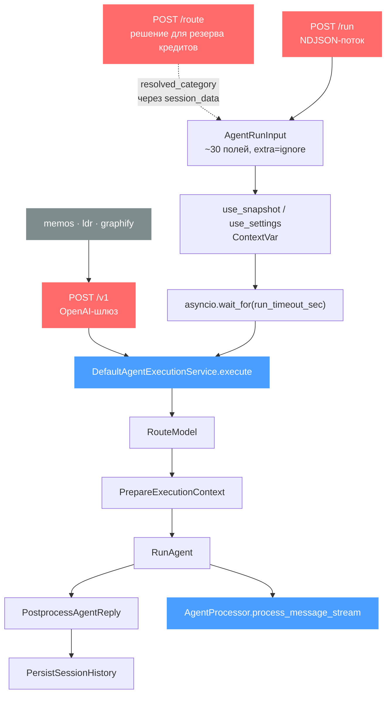
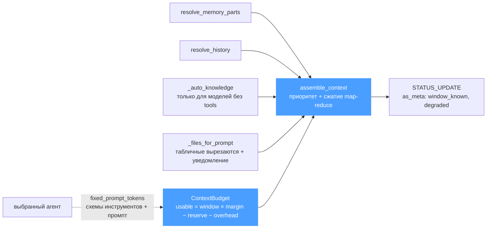
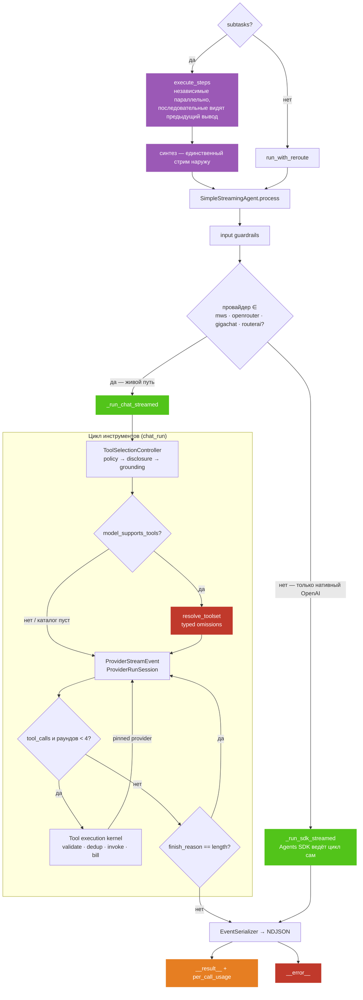
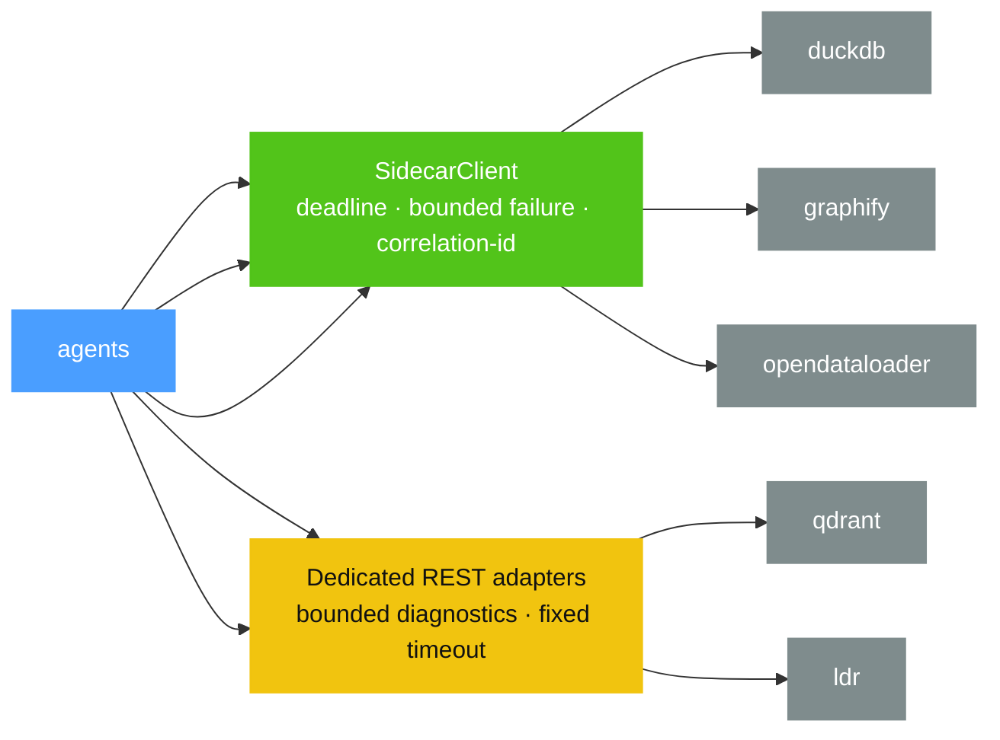

# Агентский слой: как он устроен сейчас

> Актуализировано после S25 и в ходе S26. Исторические красные узлы ниже оставлены только там,
> где долг всё ещё существует; контракты usage, terminal latch, S11 и GigaChat описывают
> фактический production-код, а не прежний roadmap.

Схема снята с кода, а не с намерений. Каждый узел — существующая функция; подписи на рёбрах
называют условие, по которому ветка выбирается. Целевое устройство — в
[architecture-target.md](architecture-target.md).

Сайдкар **не хранит состояния**: история, память, резюме, текст вложений и презайнед-ссылки
приезжают в теле `/run`. Это и есть свойство, ради которого контракт такой большой, и оно
ограничивает всё остальное — в частности, поэтому workspace в целевой схеме получает
идентификатор в теле, а не каталог на диске сайдкара.

---

## 1. Вход и оболочка прогона

⚠️ `/route` на живом пути **не вызывается**: чат ходит по WebSocket в backend, а тот зовёт
`/run`. `/route` существует ради резерва кредитов на REST-пути, и его ответ приезжает обратно
через `session_data["_resolved_category"]` — именно поэтому в фазе 1 есть ветка «маршрут уже
решён на входе».

---

## 2. Фаза 1 — кто отвечает (`_resolve_route_and_plan`)

```mermaid
graph TB
    In["user_input + вложения"]
    Norm["normalize_attachments"]
    MM{"≥2 модальностей?<br/>should_fan_out"}

    subgraph Fanout["Готовит КОНТЕКСТ, не задачу"]
        Fan["run_modality_fanout — parallel"]
        Analysts["Image · Audio · Data · Code · Document<br/>ContextAgent"]
        Agg["агрегированный контекст"]
    end

    Block{"_blocking_reason?"}
    Pass["AutoPlan.passthrough()<br/>всё как раньше"]
    Short{"shortcut_decision?<br/>закрытый словарь"}
    Decide["decide_modes<br/>create_chat_completion(AUTO_PROMPT)"]
    NormD["normalize_decision<br/>пофильная деградация"]
    Dec["AutoDecision<br/>route · confidence · needs_fresh_data<br/>needs_plan · multi_step · reason_code · source"]

    Conf{"route ∈ confirm_modes?"}
    Offer["mode_offer — кнопка<br/>route ← general"]
    Plan["AutoPlan<br/>route_hint · planning · multi_intent<br/>web_tool · force_decompose"]

    Legacy["Orchestrator.route<br/>только policy, LLM-роутер удалён"]
    Cat["resolved_category"]

    WF{"маршрут — объявленный workflow?"}
    DecAllow{"decomposition_allowed?"}
    Decomp["decompose_intents<br/>force обходит regex-префильтр"]
    Sub["subtasks"]

    PB{"plan_blockers?"}
    Complex["assess_is_complex<br/>эвристика + LLM"]
    Build["build_plan"]

    Decision["RouteDecision<br/>agent_name · subtasks · plan_context · multimodal"]

    In --> Norm --> MM
    MM -- "да" --> Fan --> Analysts --> Agg --> Block
    MM -- "нет" --> Block
    Block -- "форс / не-текст / мультимодал<br/>/ маршрут уже решён" --> Pass
    Block -- "можно решать" --> Short
    Short -- "смолток, продолжение<br/>0 вызовов модели" --> Dec
    Short -- "промах" --> Decide --> NormD --> Dec
    Dec --> Conf
    Conf -- "да" --> Offer --> Plan
    Conf -- "нет" --> Plan

    Plan -- "route_hint" --> Cat
    Pass --> Legacy --> Cat
    Cat --> WF
    WF -- "да: готовые шаги" --> Sub
    WF -- "нет" --> DecAllow
    Plan -. "web_tool → context.web_tool_enabled" .-> DecAllow
    DecAllow -- "да" --> Decomp --> Sub --> Decision
    DecAllow -- "нет" --> PB
    PB -- "нет блокеров, planning=None" --> Complex --> Build --> Decision
    PB -- "заблокировано" --> Decision

    style Fan fill:#9b59b6,stroke:#9b59b6,color:#fff
    style Analysts fill:#9b59b6,stroke:#9b59b6,color:#fff
    style Agg fill:#9b59b6,stroke:#9b59b6,color:#fff
    style Decide fill:#ffa500,stroke:#ffa500,color:#fff
    style Dec fill:#ffa500,stroke:#ffa500,color:#fff
    style Plan fill:#ffa500,stroke:#ffa500,color:#fff
    style Legacy fill:#ffa500,stroke:#ffa500,color:#fff,stroke-dasharray: 6 4
    style Complex fill:#ffa500,stroke:#ffa500,color:#fff
    style Build fill:#ffa500,stroke:#ffa500,color:#fff
    style Decision fill:#4a9eff,stroke:#4a9eff,color:#fff
```

Что здесь важно и чего не видно из имён функций:

🔴 **Категорийный LLM-роутер УДАЛЁН.** Он был вторым мнением о том же тексте и звался только
при обходе оркестратора: при явном выборе человека (там он и не нужен — это policy) либо при
СБОЕ решателя, когда второй вызов шёл к тому же провайдерскому стеку, который только что не
справился. `Orchestrator.route` остался чистой policy с безопасным `general`, а каждый обход
считается событием `legacy_route_used` — по нему видно, не понадобился ли он снова.

🔴 **Приоритет форса обеспечен НЕИСПОЛНЕНИЕМ.** `_blocking_reason` отсекает вызов оркестратора
целиком, а не игнорирует его результат: иначе мы платили бы за выброшенное решение, и однажды
ветка ниже потеряла бы приоритет.

⚠️ **`assess_is_complex` достижим ТОЛЬКО через `plan_blockers`** и только когда тумблер
планирования не сказан вслух. Старая схема в `docs/agents.md` рисовала его гейтом всех
категорий — это было неверно.

⚠️ **Мульти-интент и модальности ортогональны.** Fan-out готовит КОНТЕКСТ, декомпозиция делит
ЗАДАЧУ. Здесь уже была регрессия: декомпозиция жила в `else` к `if multimodal`, и любые два
вложения молча её отменяли.

⚠️ Короткий путь (`shortcut_decision`) **не рассуждает о стратегиях**: он вправе удешевить
решение, но не тратить деньги, поэтому `planning`/`multi_intent` остаются как были.

---

## 3. Фаза 2 — что он видит (`_build_context`)

🔴 **Порядок фаз — не стиль, а зависимость.** Бюджет считается от `fixed_prompt_tokens`
ВЫБРАННОГО агента, то есть контекст нельзя собрать до маршрутизации. Старая схема рисовала
сборку контекста перед выбором агента.

---

## 4. Фаза 3 — исполнение и цикл инструментов

**Отсев больше не молчаливый.** Сначала `resolve_toolset` применяет configuration/model/
confirmation policy и формирует typed omissions. При 15+ кандидатах S11 раскрывает tier; для
детерминированного обязательного grounding контроллер может отработать и на меньшем наборе.
Selector не способен вернуть запрещённый инструмент, а fallback оставляет полный уже разрешённый
набор. Trace содержит только bounded counts/status/reason.

**Usage и финализация однозначны.** Каждый принятый model-call регистрирует один
`UsageReceipt` в `RunExecutionContext.usage`; `ReplyAssembler` строит прежний wire-format из
ledger. На границе agents→backend первый валидный `__result__` неизменяем, поздние terminal/event
линии считаются протокольными аномалиями и не создают второй billing envelope.

⚠️ **Почему живой путь не SDK.** `chat_run` существует ради фейловера до первой принятой дельты,
жёсткого пиннинга после неё, grounding latch и provider-specific private state. GigaChat adapter
компилирует актуальный `functions/function_call`, переносит `functions_state_id` только внутри run
и не отправляет OpenAI-specific `stream_options`.

---

## 5. Интеграционные границы

Graphify, OpenDataLoader и DuckDB используют общий `SidecarClient`; Qdrant и LDR пока имеют
отдельные REST-адаптеры со своими фиксированными timeout и bounded diagnostics. Разница показана
явно, а не выдана за уже завершённую унификацию. Raw body, URL и exception text не выходят в
events, health или production-log. MCP автоматически повторяет только безопасный discovery, но
никогда не `tools/call`.

---

## 6. Цена расширения и защитные реестры

`CapabilityRegistry` уже является источником `AgentSpec`/`WorkflowSpec`: routable/forceable/
decomposable категории, prompt hints, русские labels и billing names выводятся из spec, а не из
набора несвязанных литералов. `ToolSpec` тем же способом несёт policy, schema, effect,
concurrency/dedup и grounding role.

Остаются несколько намеренно раздвоенных межсервисных контрактов:

| контракт | почему копий несколько | защита |
| --- | --- | --- |
| `AgentEvent` | agents производит, backend принимает без общего Python package | byte parity + runtime tests |
| `ProtocolManifest` | frontend не импортирует Python, сервисы выкатываются по очереди | root offline parity gate |
| model catalog / billing names | разные владельцы routing и charging | contract/shared-copy gates |

Provider выбирается не только по имени: `ModelRequirement(chat/tools/vision)` квалифицирует
фактически обнаруженную модель до pinning. Недоступный каталог может использовать статический
fallback, но валидный embedding-only каталог не превращается в chat-capable. После первой принятой
дельты или успешного non-stream ответа `ProviderRunSession` запрещает failover.

Главный оставшийся риск композиционный, а не локальный: один и тот же run проходит router,
служебные model calls, tool rounds, backend terminal latch и charging. Поэтому S26 держится на
парном golden corpus, полном manifest и privacy sentinel, а не на ещё одном production heuristic.
