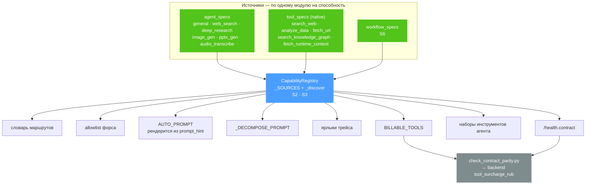
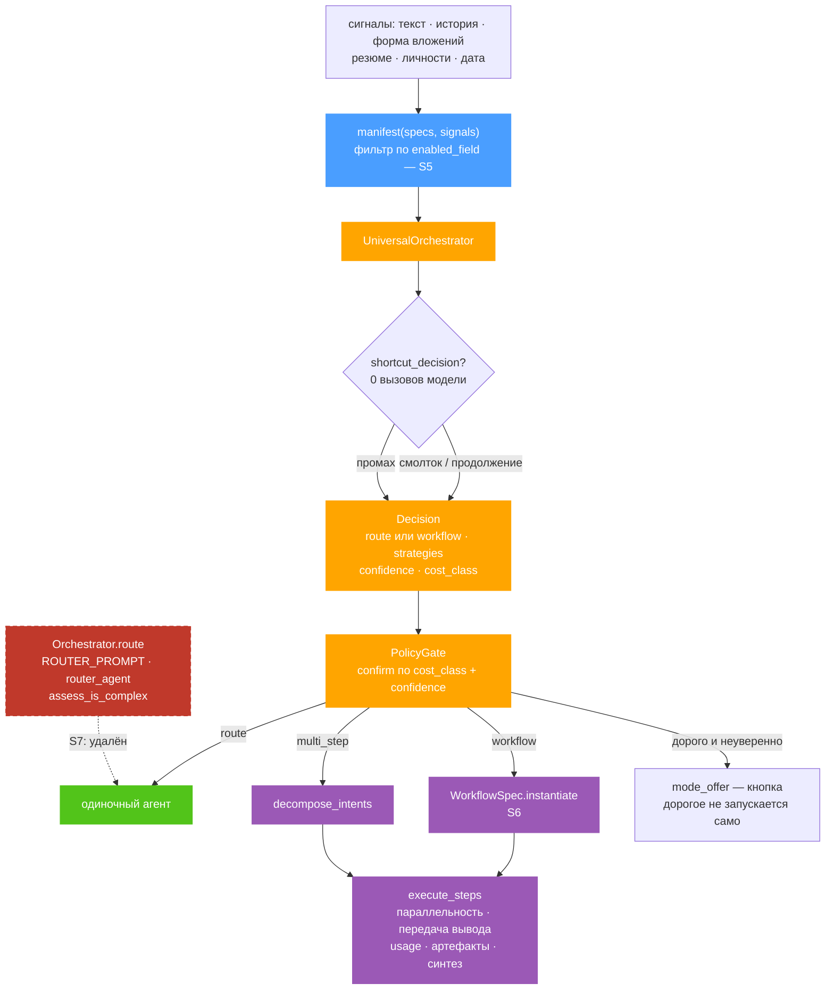
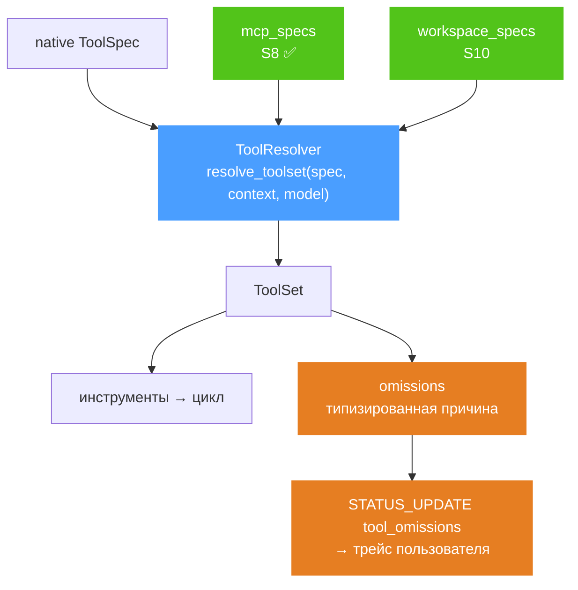
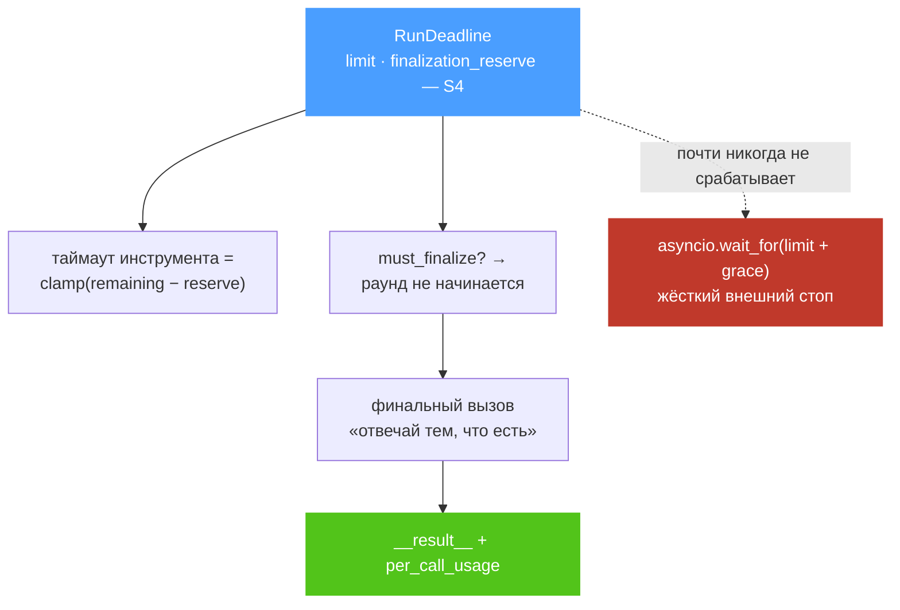
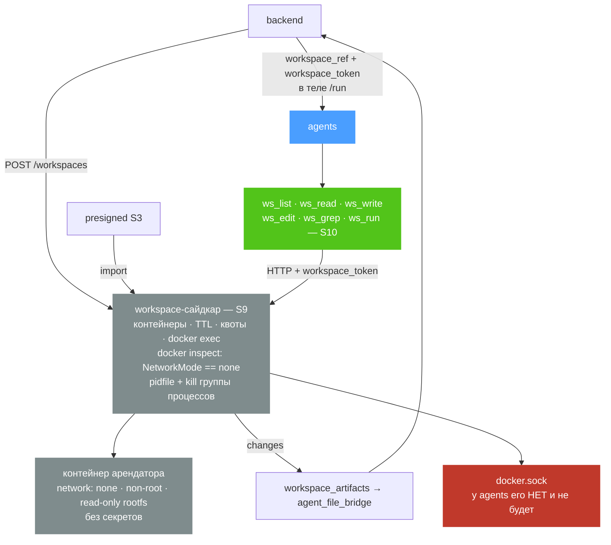

# Агентский слой: целевое устройство

Куда идём и зачем. Текущее состояние — в [architecture-current.md](architecture-current.md);
читать имеет смысл подряд, потому что каждый узел здесь удаляет конкретную боль оттуда.

**Задача не «сделать красивее», а снизить стоимость расширения.** Сегодня добавление субагента
трогает 13-14 файлов, и пропуск любого деградирует молча. Провайдер при этом добавляется двумя
файлами, потому что всё выводится из `ProviderSpec` и это держит тест, объявляющий фиктивного
провайдера целиком внутри себя. Целевая схема — распространение ровно этого приёма на агентов,
инструменты и workflow.

S1–S25 здесь считаются поставленным baseline. Открытая цель S26 — не новая способность, а
production-конвергенция: единый ledger, полная offline parity, квалификация моделей, безопасный
transport и доказанный browser/live contract.

---

## 1. Реестр способностей — центр тяжести

**Веер рёбер из `CapabilityRegistry` и есть весь аргумент схемы.** Сегодня каждое из этих восьми
мест — отдельный литеральный список, который правится руками; здесь все они выводятся из спеки.

🔴 **Промпт — это данные.** `AUTO_PROMPT` перестаёт быть константой и собирается из статичной
прозы плюс блока маршрутов, отрендеренного по `prompt_hint`. Правка пробела в промпте есть правка
поведения модели, поэтому рендер сверяется **побайтово** с золотым файлом, снятым с сегодняшних
констант: без этого рефакторинг молча пере-настроил бы модель.

⚠️ **Открытие — явным кортежем `_SOURCES`, а не `pkgutil`.** Детерминированный порядок импорта,
опечатка даёт красный тест вместо пропавшей способности, и список можно сверить с
`extra="forbid"`-настройками. Автооткрытие нужно плагин-хосту; у нас монорепозиторий.

**Гарантия** — `tests/test_new_agent_requires_one_place.py`: объявляет фиктивного агента целиком
внутри теста, регистрирует настоящим путём открытия и требует его появления во всех восьми
выводимых местах. Убрать агента из любого — тест краснеет.

---

## 2. Универсальный оркестратор

🔴 **Workflow и мульти-интент сходятся в ОДИН узел.** `execute_steps` уже умеет всё, что нужно
workflow-агенту: параллелит независимые шаги, передаёт вывод предыдущего следующему, пере-эмитит
`token_usage` и артефакты списком, рисует прогресс и синтезирует один ответ. Объявленный workflow —
это предзаданный `list[SubTask]` вместо LLM-декомпозиции, и в конвейер добавляется ~12 строк.
**Новой машинерии не строится**, и схема обязана это показывать. Страж: объявленный workflow и
декомпозиция с теми же шагами дают побайтово одинаковый поток событий.

⚠️ **Манифест фильтруется по `enabled_field`.** Выключенный админом агент модели не предлагается
вовсе — вместо того чтобы быть предложенным и затем упасть.

⚠️ **Дорогие рычаги остаются только два — `route` и `workflow`**, и оба проходят гейт. Свободный
выбор инструментов моделью отвергнут: контроль стоимости принадлежит политике, а не модели.

**Legacy удаляется по измерению, а не по решению.** Сначала телеметрия `legacy_route_used` на
каждом passthrough, затем снятие условий `_blocking_reason` по одному, каждое за своим флагом.
Когда счётчик падает до genuine `route_override` (это выбор человека, а не маршрутизация) —
удаление. Необратимый шаг делается последним.

---

## 3. Инструменты: один резолвер для трёх источников

🔴 **Отсев перестаёт быть молчаливым.** Сегодня инструмент без нужных данных просто исчезает из
списка, и снаружи это неотличимо от «модель решила им не пользоваться» — а модель тем временем
уверенно отвечает по памяти вместо того, чтобы поискать. Вводится закрытый словарь причин:

`missing_data · disabled_by_config · model_no_tool_support · catalog_unknown · not_in_tier ·
missing_credential · mcp_discovery_error · resource_blocked`

Различие `catalog_unknown` («мы не смогли выяснить») и `model_no_tool_support` («модель не умеет»)
сегодня доступно только по логу — существующий тест на молчаливую деградацию так и проверяет,
записи в логе, потому что другого следа нет. С типизированным отчётом он проверяет событие.

**Это же и есть точка слияния MCP и workspace**: обе новые группы инструментов регистрируются
обычными `ToolSpec` и наследуют гейт, лимиты, таймауты, биллинг и отчёт об отказах — без единой
своей строки на каждый из этих механизмов.

⚠️ **Лимит результата — per-tool, а не общий.** Сегодняшние 6000 символов остаются дефолтом, но
`ws_read` и канонические чтения MCP получают исключение: молча обрезанное чтение файла — это
неверное чтение, а не короткое.

---

## 4. Дедлайн: цикл, который успевает ответить

🔴 **Здесь закрывается потеря денег.** Сегодня по дедлайну уходит только `__error__`, а
накопленный `per_call_usage` отменяется вместе с задачей — прогон, сжёгший десятки тысяч токенов,
тарифицируется по мин-флору. Мягкий дедлайн возвращает **обычный** result-dict с пометкой
`deadline_exceeded`, а `wait_for` остаётся жёстким внешним стопом, который в норме не срабатывает.

⚠️ **Кламп нужен не ради аккуратности.** Один медленный `fetch_url` сегодня способен съесть весь
бюджет, оставшийся на то, чтобы вообще сформулировать ответ.

---

## 5. Workspace: агент работает с файлами

🔴 **Сайдкар `agents` не получает docker.sock ни при каких условиях.** Он исполняет управляемый
моделью поток управления и обслуживает всех арендаторов одним процессом; сокет в нём — это root на
хосте. Ровно поэтому у Уробороса, откуда взят приём, жизненный цикл контейнера живёт **вне**
runtime: тот только *использует* контейнер, а *создаёт* его внешний харнесс. Отсутствующее ребро
нарисовано намеренно — оно часть контракта.

🔴 **Токен владения обязателен.** Backend подписывает `HMAC(secret, workspace_id | user_id | exp)`,
workspace-сайдкар проверяет. Без него угаданный `workspace_id` — это доступ к чужой файловой
системе, а идентификаторы попадают в трейсы и логи.

🔴 **Изоляция проверяется, а не заявляется.** `docker inspect` подтверждает `NetworkMode == none`,
иначе сервис отказывается работать. Незаверенное заявление о песочнице однажды разойдётся с фактом,
и заметить это будет нечем.

⚠️ **Statelessness сохраняется.** Идентификатор — это состояние, и оно живёт там, где состояние уже
живёт: в PG у backend, на строке треда, в теле `/run` — ровно как `tabular_files` и `repo_graph_ids`
сегодня. Никакого workspace-состояния внутри `agents` не появляется, иначе ломается горизонтальное
масштабирование, ради которого контракт `/run` и такой большой.

⚠️ **`type: "none"` — полноценный режим.** Без выданного workspace инструменты отбираются с
причиной `resource_blocked`, то есть тесты и обычный чат идут прежним путём, а код агента один и
тот же. Отдельного «локального» исполнителя не будет: «без песочницы» обязано означать «инструментов
нет», а не «выполняем команды на хосте сайдкара».

⚠️ **Байты агент не трогает.** Файлы внутрь импортирует сам workspace-сайдкар по presigned-ссылке,
наружу отдаёт список изменений — тот же приём, что уже работает для табличных файлов.

---

## 6. MCP: чужие инструменты как свои ✅

**Отгружено (S8).** Клиент, не сервер. Инструменты внешних MCP-серверов превращаются в объекты формы `FunctionTool` и
регистрируются обычными `ToolSpec(source="mcp")` — дальше они неотличимы от родных.

⚠️ **Почему свой клиент, а не `agents.mcp` из SDK.** `Agent(mcp_servers=…)` исполняется только на
SDK-пути, а живой путь для всех четырёх рабочих провайдеров — `chat_run`. Получилась бы
способность, работающая в тестах и на нативном OpenAI, и больше нигде. Библиотека `mcp` при этом
уже стоит транзитивно — новой зависимости не требуется.

🔴 **URL сервера никогда не приходит из тела `/run`.** Это прямой SSRF во внутреннюю сеть, где
Postgres, Redis, MinIO, Qdrant и все сайдкары доступны без аутентификации по топологии, — из поля,
которым управляет пользователь. Серверы объявляет админка, тенанту приезжает **allowlist
идентификаторов**.

🔴 **Содержимое чужого сервера — данные, а не инструкции.** Имена, описания, текстовые поля схем и
результаты оборачиваются как недоверенный контент, иначе описание инструмента становится каналом
инъекции промпта.

⚠️ **Биллинг — ОДНА запись `mcp_tool`**, не по серверу и не по инструменту. Иначе каждый новый
сервер превращается в согласованный релиз двух репозиториев через парити-гейт.

⚠️ Потолки на число инструментов и байты схем обязательны: манифест одного разговорчивого сервера
иначе вытеснит из бюджета контекста файл пользователя. Их два: на сервер (`MAX_TOOLS_PER_SERVER`) и
на весь прогон (`MAX_TOOLS_TOTAL`) — второй не выводится из первого, пока серверов больше одного.

**Как это устроено по факту.** `infrastructure/mcp/`: `naming` (имя вида `mcp_<сервер>__<инструмент>`
— источник виден, столкновение с родным именем невозможно), `sanitize` (рамка недоверенного
источника и потолки), `server_ref` (объявлено админом ∩ разрешено тенанту ∩ включено — ПЕРЕСЕЧЕНИЕ,
любое «нет» означает «нет»), `adapter` (описание → `ToolSpec`), `transport` (JSON-RPC поверх
streamable-HTTP: `initialize` → `tools/list` → `tools/call`, разбор и JSON, и SSE), `runtime`
(набор одного прогона в ContextVar).

🔴 **Редиректы не ходим вовсе.** Проверка адреса делается на открытии сессии, и 3xx на внутренний
хост — классический способ её обойти. Отказ проще перепроверки каждого хопа и не оставляет щели
между ними. ⚠️ От DNS rebinding это не защищает: закрыть его на этом уровне нечем, и заявлять
обратное было бы хуже, чем не заявлять.

⚠️ **Сервер, который лёг, пропускается — прогон продолжается.** Инструмент, чей сервер умер уже
после выдачи модели, возвращает МОДЕЛИ текст «сервер не ответил, скажи об этом прямо», а не
исключение: ход не роняется, и выдумывать результат модели не предлагается.

⚠️ **Персонального разрешения пока не существует** — его негде задать (ни колонки в БД, ни экрана в
панели), поэтому backend шлёт идентификаторы всех серверов, включённых админом. Пересечение на
стороне сайдкара при этом не декоративно: как появится персональное право, сузить набор нужно будет
в одном месте — в `build_engine_env`.

---

## 7. Порядок

| # | Этап | Отгружается сам | Обратимо |
| --- | --- | --- | --- |
| S1 | `settings.py` → пакет | да | да |
| S2 | Реестр `AgentSpec` + генерируемые промпты | да | да |
| S3 | `ToolSpec` + отчёт об отказах + per-tool лимиты | да | да |
| S4 | `tool_loop.py` + `RunDeadline` + частичный результат | да | флагом `reserve=0` |
| S5 | Оркестратор на манифесте + телеметрия legacy | да | да |
| S6 | Workflow-агенты на `execute_steps` ✅ | да | да |
| S7 | Удаление legacy-роутера ✅ | да | **нет** |
| S8 | MCP-клиент ✅ | да | флагом на сервер |
| S9 | Сайдкар `workspace` | новый сервис | да |
| S10 | Workspace-инструменты | нужен backend | `type:"none"` |
| S11 | Прогрессивное раскрытие инструментов | да | да |
| S12 | MCP resilience, typed tool outcomes, catalog outbox | да | rollout mode |
| S13 | Safe in-flight/completed dedup + golden tool-loop | да | rollout mode |
| S14 | Full-run privacy/budget corpus | да | да |
| S15 | First-valid-result terminal latch | да | нет |
| S16 | Cross-service deterministic quality gate | да | да |
| S17 | Policy-first auto-mode, bounded rationale | да | нет |
| S18 | Durable atomic workspace | да | да |
| S19 | Coordination room, leases and fencing | да | да |
| S20–S22 | Work Hub and reliable intake | да | URL surface |
| S23 | Stateful provider/tool protocol and subagent runtime | да | provider policy |
| S24–S25 | Run context, ledger and grounding latch | да | deterministic scope |
| S26 | Production convergence and complete parity | release gate | нет |

**Извлечение предшествует добавлению.** Production-модули agents удерживаются в пределах
complexity gate; orchestration, provider protocol, tool runtime и subagent stages разнесены по
узким пакетам. Новая логика сначала получает владельца состояния и тестовый contract, а затем
подключается в composition layer — пороги CI ради роста не повышаются.

**Автономный workflow-каталог уже внутренний.** Backend владеет версиями, executions, feedback,
агрегатами и outbox; пользовательского pin/offer UI нет. Qdrant содержит только безопасную
проекцию, а точные примеры запросов остаются в PostgreSQL под retention. Выбранный дорогой
workflow заново проходит актуальный confirmation/cost policy.

**S11 работает только после policy.** Обычный selector включается при 15+ уже разрешённых
инструментах; `observe` не сокращает основной набор. Исключение — детерминированный
`GroundingRequirement`: он может запустить selection на меньшем наборе, но не открыть omitted или
confirmation-locked tool. Один repair-round допустим только для missing/wrong/invalid вызова;
реальный integration failure автоматически не повторяется.

## 8. S26 release contract

- `RunExecutionContext` и `UsageLedger` — единственные production-владельцы usage и private state.
- `ProtocolManifest` полностью сверяет `/run`, events, bounded codes, usage kinds и Work snapshot
  между agents/backend/frontend без сети.
- `ModelRequirement(chat/tools/vision)` применяется до pinning; embedding-only каталог не делает
  провайдера chat-capable, а vision никогда не деградирует на незрячую модель.
- Backend terminal latch принимает только первый валидный result и проводит один idempotent
  charging/persistence path.
- Live GigaChat и Work Hub остаются acceptance, а не CI-зависимостью; offline golden/parity/privacy
  corpus является обязательным merge-gate.
- Перед production-релизом оператор ротирует ранее использованные dev DB credentials; Alembic и
  integration diagnostics не печатают DSN или значения секретов.
