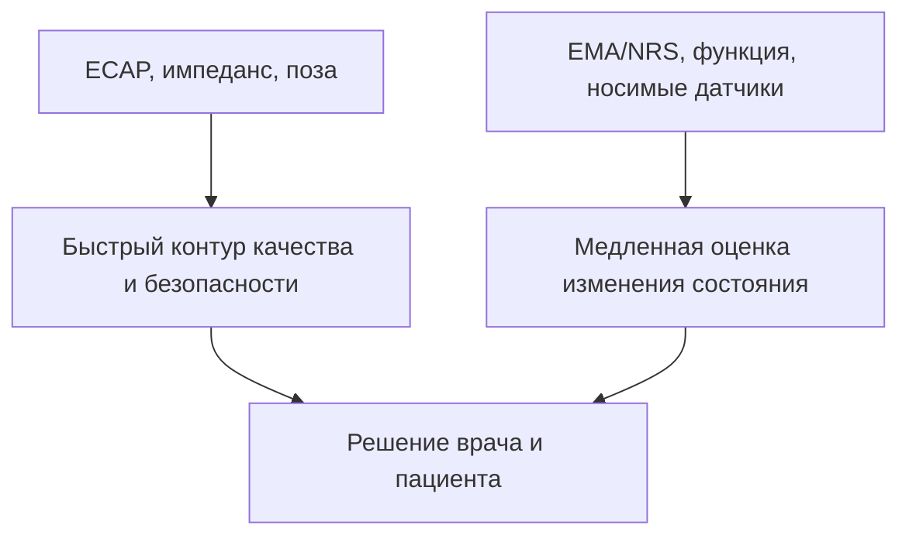

# Карта доказательств для оценки болевого состояния в медицинских системах

Дата исходного среза: 6 сентября 2026 года  
Дата актуализации: 12 сентября 2026 года  
Формат: расширенный библиографический реестр и фактическая карта систематического обзора  
Итог: 53 записи в расширенном библиографическом пуле, 50 источников в статье и 130 включенных исследований. Полный реестр и аналитические таблицы опубликованы в [открытом приложении версии 1.0.0](https://github.com/deneal123/AISCS/releases/tag/min-2026-review-v1.0.0).

Документ служит реестром доказательств. Актуальные формулировки темы, задачи, структура диссертации и календарь аттестаций приведены в [научном плане](./tema-dissertacii-i-datasety.md); материалы первой статьи — в [отдельном редакционном плане](./materialy-dlya-obzornoi-stati.md).

## Главный вывод

Научно защищаемая постановка — не «объективный детектор боли», а **оценка заранее определенной характеристики боли, ее изменения или функционального состояния по физиологическим, поведенческим и нейронным признакам с явными границами применимости**.

Боль — личный сенсорный и эмоциональный опыт. IASP отдельно подчеркивает, что боль и ноцицепция различны и что боль нельзя вывести только из активности сенсорных нейронов. Поэтому для каждой модели необходимо явно называть целевую переменную:

1. самоотчет пациента: NRS/VAS/CoVAS или изменение этих шкал;
2. реакция на ноцицептивный стимул;
3. наблюдаемое выражение или защитное поведение;
4. прогноз клинического ответа на SCS;
5. ECAP и вовлечение нервных волокон — характеристики доставленной стимуляции, но **не интенсивность боли**.

Рекомендуемая широкая формулировка темы диссертации:

> **Методы и программно-алгоритмическое обеспечение оценки болевого состояния человека в медицинских системах.**

Конкретные модальности, алгоритмы и архитектуры, включая классические методы, нейронные сети и трансформеры, выбираются по результатам исследований и не фиксируются в названии. Нейростимуляция спинного мозга остается перспективным сценарием применения, но доступ к прототипу не является условием завершения диссертации.

## Как выполнены 10 итераций

После каждого прохода запись сохранялась в рабочем реестре только после проверки DOI или официальной страницы, соответствия задачи, популяции, меток, схемы валидации и, для наборов данных, режима доступа. Дубликаты, неверно сопоставленные DOI, препринты без последующей публикации, наборы стресса или эмоций без связанных с болью меток и статьи с нерелевантной целевой переменной исключались.

| Итерация | Фокус | Что осталось после фильтрации |
|---:|---|---|
| 1 | Определение боли и клиническая эталонная оценка | IASP, IMMPACT, клинически значимое изменение NRS |
| 2 | Обзоры ML, физиологии, лица и EEG | 9 обзоров с разделением острой и хронической боли, боли и ноцицепции |
| 3 | Ядро физиологических данных | PainMonit, BioVid, X-ITE; проверены метки, участники и доступ |
| 4 | Реально доступные данные | PhysioPain, RheumaPain, TAME, CoSpine и ограниченный PhysioNet; наборы по запросу вынесены отдельно |
| 5 | Лицо, голос и движение | UNBC, EmoPain, EmoPain@Home, MIntPAIN; поведение не приравнивается к интенсивности боли |
| 6 | EEG, fMRI и внутричерепные маркеры | Нейросигнатуры оставлены исследовательскими косвенными признаками, а не клинической эталонной оценкой |
| 7 | SCS с замкнутой обратной связью и ECAP | Разделены вовлечение нервных волокон, контроль дозы и самоотчет боли |
| 8 | ML-прогноз ответа на SCS | Оставлены работы с проверяемыми выборками; малые исследования EEG и нейровизуализации отнесены к проверке осуществимости |
| 9 | Воспроизводимость и риск смещения | PRISMA 2020, PRISMA-S, TRIPOD-SRMA, PROBAST+AI |
| 10 | Дедупликация, отрицательная проверка и план | Исправлены ложные DOI и утверждения, сформирован план из 16 самостоятельных публикационных материалов |

### Уровень проверки записей

- **M** — метаданные совпали на DOI/PubMed/официальной странице издателя.
- **T** — проверены реальная целевая переменная, популяция и тип задачи.
- **V** — проверены схема валидации и главный риск утечки или смещения.
- **A** — для набора данных проверены официальный путь доступа и ограничения.

Расширенный библиографический пул содержит 53 ранее проверенные записи. Пятьдесят источников использованы в конференционной статье, а количественный корпус после повторного отбора включает 130 исследований; все они перечислены в отдельном идентифицируемом приложении. Эти три числа относятся к разным совокупностям. Проверка метаданных не означает низкого риска смещения: слабая работа может быть значимым отрицательным или историческим примером.

## Расширенный библиографический пул: 53 проверенные записи

### A. Определения, целевые показатели и обзоры

| № | Источник | Что проверено и зачем оставлен |
|---:|---|---|
| 1 | Raja et al. (2020), [The revised IASP definition of pain](https://pubmed.ncbi.nlm.nih.gov/32694387/), DOI `10.1097/j.pain.0000000000001939` | **M/T/V.** Базовое определение: боль лична; боль и ноцицепция различны. Ограничивает допустимые утверждения ML-модели. |
| 2 | Dworkin et al. (2005), [Core outcome measures for chronic pain clinical trials](https://pubmed.ncbi.nlm.nih.gov/15621359/), DOI `10.1016/j.pain.2004.09.012` | **M/T/V.** IMMPACT: одной интенсивности боли недостаточно; нужны функция, нежелательные явления и другие основные области исхода. |
| 3 | Farrar et al. (2001), [Clinically important change on an 11-point NRS](https://pubmed.ncbi.nlm.nih.gov/11690728/), DOI `10.1016/S0304-3959(01)00349-9` | **M/T/V.** Обосновывает изменение примерно на 2 пункта или 30 % как клинически значимое при хронической боли; это не порог мгновенного распознавания. |
| 4 | Werner et al. (2019/2022), [Automatic Recognition Methods Supporting Pain Assessment: A Survey](https://ieeexplore.ieee.org/document/8865626), DOI `10.1109/TAFFC.2019.2946774` | **M/T/V.** Полезная таксономия модальностей, целевых переменных и наборов данных; состояние поля быстро меняется. |
| 5 | Fang et al. (2025), [Survey on Pain Detection Using Machine Learning Models](https://ai.jmir.org/2025/1/e53026), DOI `10.2196/53026` | **M/T/V.** Широкая описательная карта моделей и наборов; не заменяет систематический обзор и формальную оценку риска смещения. |
| 6 | Gkikas & Tsiknakis (2023), [Automatic assessment of pain based on deep learning methods](https://pubmed.ncbi.nlm.nih.gov/36764062/), DOI `10.1016/j.cmpb.2023.107365` | **M/T/V.** Систематический обзор глубокого обучения; показывает доминирование нескольких лабораторных наборов и ограниченную клиническую переносимость. |
| 7 | Fernandez Rojas et al. (2023), [A systematic review of neurophysiological sensing for acute pain](https://www.nature.com/articles/s41746-023-00810-1), DOI `10.1038/s41746-023-00810-1` | **M/T/V.** В 48 работах разделены самоотчет, поведение и физиология; зафиксирован дефицит совместных нейронных и физиологических наборов. |
| 8 | Camacho-Navas et al. (2026), [Pain assessment using physiological responses/markers](https://www.nature.com/articles/s41746-025-02241-6), DOI `10.1038/s41746-025-02241-6` | **M/T/V.** Актуальный картирующий обзор разных типов боли; особенно важен для оценки доступности данных и клинической неоднородности. |
| 9 | Khan et al. (2025), [A Systematic Review of Multimodal Signal Fusion for Acute Pain Assessment Systems](https://dl.acm.org/doi/10.1145/3737281), DOI `10.1145/3737281` | **M/T/V.** Систематизирует многомодальное объединение, но область ограничена преимущественно острой болью и не доказывает перенос на хроническую боль или SCS. |
| 10 | Huo et al. (2024), [AI in Multilevel Pain Assessment Using Facial Images](https://www.jmir.org/2024/1/e51250), DOI `10.2196/51250` | **M/T/V.** Систематический обзор и метаанализ оценки по лицу; объединенные показатели нельзя интерпретировать без оговорок о риске смещения. |
| 11 | Mari et al. (2022), [ML for pain intensity, phenotype or treatment outcomes using EEG](https://pubmed.ncbi.nlm.nih.gov/34425248/), DOI `10.1016/j.jpain.2021.07.011` | **M/T/V.** Из 44 EEG-исследований большинство имело высокий риск смещения. Это ограничивает утверждения об универсальном EEG-биомаркере. |
| 12 | Zebhauser et al. (2023), [Resting-state EEG/MEG as biomarkers of chronic pain](https://pubmed.ncbi.nlm.nih.gov/36409624/), DOI `10.1097/j.pain.0000000000002825` | **M/T/V.** В 76 исследованиях не установлена ясная продольная связь EEG/MEG с облегчением или интенсивностью боли. |

### B. Наборы данных и официальные descriptors

| № | Источник | Данные, доступ и главный риск |
|---:|---|---|
| 13 | Gouverneur et al. (2024), [PainMonit Dataset](https://www.nature.com/articles/s41597-024-03878-w), DOI `10.1038/s41597-024-03878-w`; [данные](https://doi.org/10.6084/m9.figshare.26965159) | **M/T/V/A.** В PMED набраны 55 человек, пригодны 52; используются тепловой стимул, непрерывная CoVAS, BVP, EDA, температура, ECG, EMG и дыхание. В PMCD набраны 49 пациентов с хронической болью в руке или шее; число пригодных записей уточняется по реестру. Файлы доступны на Figshare с CC BY 4.0, однако перед работой необходимо согласовать приложенные условия академического использования. |
| 14 | Walter et al. / OVGU, [BioVid Heat Pain Database](https://www.nit.ovgu.de/nit/en/BioVid-p-1358.html), DOI статьи `10.1109/CYBConf.2013.6617456`; [открытые признаки](https://datadryad.org/dataset/doi:10.5061/dryad.2b09s) | **M/T/V/A.** Часть A содержит 87 человек, 8700 окон и пять классов, заданных стимулом. Исходные видео, GSR, ECG и EMG предоставляются по некоммерческому запросу. Dryad содержит 159 извлеченных признаков для 85 человек. EEG не распространяется. Разбиение выполняется только по участникам. |
| 15 | Gruss et al. (2019), [X-ITE Pain Database](https://www.nit.ovgu.de/nit/en/XITE%2BPain-p-1714.html), DOI `10.3791/59057` | **M/T/V/A.** Включены 134 здоровых участника, тепловая и электрическая, краткая и продолжительная стимуляция, видео лица и тела, глубина, тепловое видео, звук, EDA, ECG и sEMG. Доступность полного набора необходимо письменно подтвердить. Метки преимущественно задаются стимулом и не представляют хроническую клиническую боль. |
| 16 | Toktay et al. (2025), [PhysioPain Dataset](https://data.mendeley.com/datasets/mf2cgph9cy/4), DOI статьи `10.1016/j.dib.2025.111992` | **M/T/V/A.** Набраны 99 человек, после контроля качества доступны 93 физиологические записи. Представлены E4, признаки одноканального EEG и опросники. Набор имеет лицензию CC BY 4.0. До обучения необходимо сверить реестры, размеры подгрупп, частоту BVP и смешивающие факторы между группами боли. |
| 17 | Yıldırım & Patlar Akbulut (2026), [RheumaPain Dataset](https://data.mendeley.com/datasets/y6pgjdj22f/3), DOI статьи `10.1016/j.dib.2026.113131` | **M/T/V/A.** Включены 42 пациента детской ревматологии, сигналы E4 в покое и при упражнении и шкала Wong–Baker. Набор имеет лицензию CC BY 4.0. Активность смешана с болью; перенос на взрослую SCS-популяцию не доказан. |
| 18 | Dao et al. (2025), [TAME Pain data release](https://www.nature.com/articles/s41597-025-04733-2), DOI `10.1038/s41597-025-04733-2`; [PhysioNet](https://physionet.org/content/tame-pain/1.0.0/) | **M/T/V/A.** Включен 51 здоровый взрослый, холодовая проба, 7039 размеченных высказываний и самооценка 1–10. Доступ PhysioNet ограничен соглашением DUA 1.5.0. Обязательны разделение по говорящим и удаление фраз, раскрывающих оценку боли; часть меток перенесена на соседние высказывания. |
| 19 | Lucey et al. (2011), [UNBC-McMaster Shoulder Pain Archive](https://painarchive.jeffcohn.net/), DOI `10.1109/FG.2011.5771462` | **M/T/V/A.** Набор содержит 25 пациентов, 200 последовательностей и покадровую разметку FACS/PSPI; доступ предоставляется по соглашению. Малая клиническая выборка и множество кадров одного пациента требуют разбиения только по пациентам. |
| 20 | Aung et al. (2016), [EmoPain](https://www.ucl.ac.uk/uclic/research/affective-computing/emopain-dataset), DOI `10.1109/TAFFC.2015.2462830` | **M/T/V/A.** Текущая двигательная часть включает 18 пациентов с хронической болью и 12 здоровых участников, IMU, sEMG, видео и экспертные метки защитного поведения. Доступ предоставляется по запросу. Целевая переменная характеризует выражение и защитное поведение, а не чистую интенсивность боли. |
| 21 | Olugbade et al. (2025), [EmoPain@Home](https://www.ucl.ac.uk/uclic/research/affective-computing/emopainhome-dataset), DOI `10.1109/TAFFC.2024.3390837` | **M/T/V/A.** Включены 9 участников с хронической болью и 9 здоровых. Для первой группы доступны боль, тревога и уверенность; частоты регистрации групп различаются — 40 и 10 Гц. Набор полезен для проверки переноса в домашние условия, но слишком мал для сильного клинического утверждения. |
| 22 | Haque et al. (2018), [MIntPAIN](https://vap.aau.dk/mintpain-database/), DOI `10.1109/FG.2018.00044` | **M/T/V/A.** Включены 20 здоровых участников, четыре уровня электрической стимуляции мышцы, цветное видео, глубина и тепловое видео. Доступ предоставляется по соглашению. Набор остается лабораторным исследованием распознавания острого стимула. |
| 23 | Wei et al. (2025), [CoSpine](https://www.nature.com/articles/s41597-025-05982-x), DOI `10.1038/s41597-025-05982-x`; OpenNeuro [pain ds005883](https://openneuro.org/datasets/ds005883) | **M/T/V/A.** Открытый набор BIDS содержит одновременную fMRI мозга и шейного отдела спинного мозга. Экспериментальную тепловую болевую задачу выполнили 39 здоровых добровольцев; еще 22 здоровых участника относятся к отдельной двигательной задаче. Это не клиническая болевая группа, носимая телеметрия или данные SCS. |
| 24 | Subramanian et al. (2024), [Multimodal Physiological Indices During Surgery Under Anesthesia](https://physionet.org/content/multimodal-surgery-anesthesia/1.0/), DOI `10.13026/gs4v-4q80`; DOI статьи `10.1073/pnas.2319316121` | **M/T/V/A.** Представлены 101 операция, 18 582 минуты, 49 878 размеченных ноцицептивных событий, показатели ECG и EDA и препараты; доступ ограничен соглашением. Это ноцицепция под анестезией, а метки стимула не являются метками осознанной боли. |

### C. Репрезентативные ML-методы

| № | Источник | Почему оставлен и ограничение |
|---:|---|---|
| 25 | Gruss et al. (2015), [Pain Intensity Recognition via Biopotential Feature Patterns with SVM](https://journals.plos.org/plosone/article?id=10.1371/journal.pone.0140330), DOI `10.1371/journal.pone.0140330` | **M/T/V.** Классический интерпретируемый базовый метод на BioVid и источник открытой таблицы признаков. Исходное разбиение по окнам не является надежной оценкой на новых участниках. |
| 26 | Kächele et al. (2016), [Methods for Person-Centered Continuous Pain Intensity Assessment](https://ieeexplore.ieee.org/document/7421991/), DOI `10.1109/JSTSP.2016.2535962` | **M/T/V.** Ранняя работа о персонализации непрерывной оценки; преобразование по данным нового человека следует считать калибровкой, а не переносом без персональных данных. |
| 27 | Lopez-Martinez & Picard (2018), [Continuous Pain Intensity Estimation from Autonomic Signals with RNNs](https://pubmed.ncbi.nlm.nih.gov/30441611/), DOI `10.1109/EMBC.2018.8513575` | **M/T/V.** Важна для временной непрерывной постановки и разложения EDA; конференционная работа требует умеренных выводов. |
| 28 | Pouromran et al. (2021), [Physiological Sensors, Features, and ML Models for Pain Intensity Estimation](https://journals.plos.org/plosone/article?id=10.1371/journal.pone.0254108), DOI `10.1371/journal.pone.0254108` | **M/T/V.** Сравнение датчиков и классических регрессоров с исключением одного человека; нормализация по данным нового участника может использовать сведения тестовой выборки и должна анализироваться отдельно. |
| 29 | Kong et al. (2021), [Real-Time High-Level Acute Pain Detection Using Smartphone and Wrist EDA](https://www.mdpi.com/1424-8220/21/12/3956), DOI `10.3390/s21123956` | **M/T/V.** Практичный базовый метод для носимых устройств; автономное возбуждение неспецифично, поэтому лабораторная острая боль не переносится автоматически на хроническую боль при SCS. |
| 30 | Lu et al. (2023), [Transformer encoder with multiscale deep learning for pain classification](https://www.frontiersin.org/journals/physiology/articles/10.3389/fphys.2023.1294577/full), DOI `10.3389/fphys.2023.1294577` | **M/T/V.** Современный глубокий базовый метод на BioVid. Сравнение допустимо только на заранее заданном разбиении по участникам. |
| 31 | Ozek et al. (2024), [Uncertainty quantification in neural-network pain estimation](https://journals.plos.org/plosone/article?id=10.1371/journal.pone.0307970), DOI `10.1371/journal.pone.0307970` | **M/T/V.** Редкий пример интервалов прогноза. Покрытие интервалов на BioVid еще не доказывает клинически безопасный и калиброванный отказ от оценки. |
| 32 | Wang et al. (2021), [Chronic Pain Protective Behavior Detection with Deep Learning](https://dl.acm.org/doi/10.1145/3449068), DOI `10.1145/3449068` | **M/T/V.** Проверка LOSO на EmoPain дала среднюю F1 около 0,82. Целевая переменная относится к функции и защитному поведению, а не к интенсивности переживаемой боли. |

### D. Центральные нейронные сигнатуры боли

| № | Источник | Почему оставлен и ограничение |
|---:|---|---|
| 33 | Wager et al. (2013), [An fMRI-Based Neurologic Signature of Physical Pain](https://doi.org/10.1056/NEJMoa1204471), DOI `10.1056/NEJMoa1204471` | **M/T/V.** Историческая NPS и независимые проверки относятся преимущественно к вызванной тепловой боли у здоровых участников; это не готовый биомаркер хронической боли или SCS. |
| 34 | Woo et al. (2017), [Independent neural representation of self-reported pain](https://www.nature.com/articles/ncomms14211), DOI `10.1038/ncomms14211` | **M/T/V.** SIIPS1 показывает компонент боли сверх ноцицептивного входа; это исследовательский fMRI-маркер, а не датчик непрерывного медицинского устройства. |
| 35 | Shirvalkar et al. (2023), [First-in-human prediction of chronic pain state from intracranial neural biomarkers](https://pubmed.ncbi.nlm.nih.gov/37217725/), DOI `10.1038/s41593-023-01338-z` | **M/T/V.** Амбулаторные внутричерепные записи у четырех пациентов поддерживают идею внутриперсонального анализа, но не допускают обобщения на популяцию. |

### E. SCS, ECAP и прогноз исходов

| № | Источник | Что реально измерено и главный предел |
|---:|---|---|
| 36 | Parker et al. (2012), [Compound action potentials recorded in the human spinal cord during neurostimulation](https://pubmed.ncbi.nlm.nih.gov/22188868/), DOI `10.1016/j.pain.2011.11.023` | **M/T/V.** Основополагающее исследование регистрации и роста ECAP у человека. ECAP отражает вызванное стимулом вовлечение нервных волокон, а не спонтанное болевое состояние. |
| 37 | Parker et al. (2020), [ECAPs Reveal Spinal Cord Dorsal Column Neuroanatomy](https://pubmed.ncbi.nlm.nih.gov/31215718/), DOI `10.1111/ner.12968` | **M/T/V.** Поддерживает интерпретацию крупных чувствительных аксонов задних столбов; значительная часть доказательств получена на животных или моделях, имеются отраслевые связи. |
| 38 | Pilitsis et al. (2021), [The ECAP as a Predictor for Perception in Chronic Pain Patients](https://www.frontiersin.org/articles/10.3389/fnins.2021.673998/full), DOI `10.3389/fnins.2021.673998` | **M/T/V.** У 14 пациентов порог ECAP коррелирует с порогами восприятия и дискомфорта. Это прогноз ощущения и парестезии, а не обезболивания или NRS. |
| 39 | Brucker-Hahn et al. (2023), [ECAPs during SCS: effects of posture and pulse width](https://doi.org/10.1088/1741-2552/aceca4), DOI `10.1088/1741-2552/aceca4` | **M/T/V.** Библиотека записей 56 пациентов и модель показывают сильное влияние позы на характеристики ECAP; одинаковая амплитуда не гарантирует одинаковую нейронную активацию. |
| 40 | Deshmukh et al. (2025), [Sources of neural-appearing artifact in stimulation ECAPs](https://pubmed.ncbi.nlm.nih.gov/39321832/), DOI `10.1088/1741-2552/ad7f8b` | **M/T/V.** Доклиническая проверка показывает, что емкостные и EMG-артефакты могут имитировать нейронный сигнал. Результат важен для контроля качества ECAP. |
| 41 | Single et al. (2023), [Measures of Dosage for Spinal-Cord Electrical Stimulation](https://doi.org/10.1109/TNSRE.2023.3335100), DOI `10.1109/TNSRE.2023.3335100` | **M/T/V.** Предложена схема электрической и нейронной дозы. Это концептуальное предложение, а не проверенный биомаркер боли. |
| 42 | Muller et al. (2025), [Biomarker-based dose-response relationship in SCS](https://rapm.bmj.com/content/50/4/345), DOI `10.1136/rapm-2024-105346` | **M/T/V.** В объединенной выборке более 600 пациентов доза по ECAP связана со снижением боли по самоотчету. Наблюдаемая связь и концентрация данных одного производителя не доказывают причинное измерение боли. |
| 43 | Mekhail et al. (2020), [EVOKE closed-loop SCS randomized trial](https://pubmed.ncbi.nlm.nih.gov/31870766/), DOI `10.1016/S1474-4422(19)30414-4` | **M/T/V.** У 134 рандомизированных пациентов управление активацией по ECAP улучшило сообщаемый пациентами исход по сравнению с открытым контуром. ECAP контролирует ток и вовлечение волокон, а боль по-прежнему измеряется по исходам пациентов. Исследование финансировалось производителем. |
| 44 | Bastiaens et al. (2024), [Predictors of clinically relevant pain relief after SCS](https://pubmed.ncbi.nlm.nih.gov/38184342/), DOI `10.1016/j.neurom.2023.10.188` | **M/T/V.** Систематический обзор и метаанализ охватили 27 исследований и 2220 пациентов. Совокупную метарегрессию нельзя выдавать за модель индивидуального прогноза. |
| 45 | Hadanny et al. (2022), [ML Models to Predict Treatment Response to SCS](https://pubmed.ncbi.nlm.nih.gov/35179133/), DOI `10.1227/neu.0000000000001855` | **M/T/V.** Для 151 пациента исследованы 31 признак, кластеризация и LR/RF/XGBoost с вложенной перекрестной проверкой; AUC составила 0,757 и 0,708 для двух кластеров. Независимой внешней проверки нет. |
| 46 | Patterson et al. (2023), [Wearable measures and self-reported chronic pain in SCS](https://www.nature.com/articles/s41746-023-00892-x), DOI `10.1038/s41746-023-00892-x` | **M/T/V.** Из 20 набранных пациентов в модель вошли 15; анализировались шестимесячные данные носимых устройств и NRS/PRO. Малая выборка и неясное разделение по людям не позволяют считать точность доказательством клинической переносимости. |
| 47 | Gopal et al. (2025), [ML predicts SCS outcomes using intraoperative EEG](https://www.nature.com/articles/s41598-025-92111-8), DOI `10.1038/s41598-025-92111-8` | **M/T/V.** Из 20 набранных пациентов моделировались 17; сообщается LOOCV AUC 0,879. Отбор признаков и настройка на очень малой выборке создают высокий риск оптимистического смещения; нужна внешняя проверка. |
| 48 | Witjes et al. (2025), [Classification of chronic pain and SCS response using MEG](https://journals.plos.org/plosone/article?id=10.1371/journal.pone.0337726), DOI `10.1371/journal.pone.0337726` | **M/T/V.** Сравнивались 25 пациентов с SCS, 25 пациентов с хронической болью и 25 здоровых участников. Классификация пациентов и контроля достигала примерно 76 %, но связь результата с NRS при SCS была слабой (ρ≈0,12). Это важный отрицательный результат. |

### F. Стандарты для первой статьи

| № | Источник | Как применять |
|---:|---|---|
| 49 | Page et al. (2021), [PRISMA 2020 Statement](https://www.bmj.com/content/372/bmj.n71), DOI `10.1136/bmj.n71` | **M/T/V.** Содержит 27 элементов отчетности и схему отбора. Не является инструментом оценки качества исследований. |
| 50 | Rethlefsen et al. (2021), [PRISMA-S](https://link.springer.com/article/10.1186/s13643-020-01542-z), DOI `10.1186/s13643-020-01542-z` | **M/T/V.** Требует представлять полные запросы, базы и платформы, даты, дедупликацию и поиск по цитированию. Это стандарт отчетности поиска, а не инструмент риска смещения. |
| 51 | Snell et al. (2023), [TRIPOD-SRMA](https://www.bmj.com/content/381/bmj-2022-073538), DOI `10.1136/bmj-2022-073538` | **M/T/V.** Для обзоров прогностических моделей разделяет разработку, внутреннюю и внешнюю проверку; требует извлекать различительную способность и калибровку. |
| 52 | Moons et al. (2025), [PROBAST+AI](https://www.bmj.com/content/388/bmj-2024-082505), DOI `10.1136/bmj-2024-082505` | **M/T/V.** Оценивает качество, риск смещения и применимость регрессионных и ML-моделей на уровне модели и проверки, а не всей статьи. |
| 53 | Tricco et al. (2018), [PRISMA Extension for Scoping Reviews](https://pubmed.ncbi.nlm.nih.gov/30178033/), DOI `10.7326/M18-0850` | **M/T/V.** Требования к прозрачному представлению картирующих обзоров; стандарт отчетности, а не оценка качества первичных исследований. |

Дополнительный методический инструментарий, не включенный в число 53: [TRIPOD+AI](https://www.bmj.com/content/385/bmj-2023-078378) для собственных прогностических моделей; [DECIDE-AI](https://www.nature.com/articles/s41591-022-01772-9) для ранней клинической проверки; [Saeb et al.](https://academic.oup.com/gigascience/article/6/5/gix019/3071704) для обоснования разбиения по участникам; [Varoquaux et al.](https://doi.org/10.1016/j.neuroimage.2016.10.038) для вложенной перекрестной проверки на малых нейровизуализационных выборках.

## Что исключено

### Ошибочные или несоответствующие записи из приложенных черновиков

| Заявленная запись | Что оказалось при проверке | Решение |
|---|---|---|
| DOI `10.1111/ner.13353` как обзор ML/SCS | Это *Targeted Drug Delivery for Chronic Nonmalignant Pain* | Исключить и не цитировать как прогноз SCS |
| DOI `10.1093/pm/pnaa354` как систематический обзор ML | Это исправление к другой публикации | Исключить |
| DOI `10.1016/j.artmed.2019.101789` как обзор боли | Это статья о диагностике по ECG с глубоким обучением | Исключить |
| Fernandez Rojas, IEEE RBME 2019, DOI `10.1109/RBME.2018.2880829` | Сочетание автора, названия и DOI не подтвердилось | Заменить на реальный обзор npj Digital Medicine 2023, источник № 7 |
| Zhang 2020, персонализированная SCS, DOI `10.1109/TNSRE.2020.2970920` | Соответствие заявленной публикации не подтверждено | Исключить до получения корректной записи |
| BioVid якобы содержит открытые исходные данные и EEG | Открыта только таблица извлеченных признаков; исходные данные предоставляются по запросу, EEG недоступен | Исправлено в источнике № 14 |
| X-ITE как клинический открытый набор из 11 частей | Включает 134 здоровых участника и тепловые и электрические протоколы; выдача полного корпуса требует подтверждения | Исправлено в источнике № 15 |
| PainMonit как один массив из 104 или 101 пригодного участника | Это две разные когорты: в PMED набраны 55 и пригодны 52, в PMCD набраны 49; пригодность PMCD проверяется по реестру | Не суммировать когорты как единое число пригодных участников |

Также исключены WESAD, DEAP и CASE: это наборы стресса, эмоций и возбуждения без связанной с болью эталонной метки. BP4D+ и EMOCOLD оставлены вне ядра из-за риска распознавать холодовую пробу или тревогу вместо интенсивности боли. SynPAIN и другие синтетические материалы или препринты не используются как клиническое доказательство. SenseEmotion и AI4PAIN не вошли в ядро из-за неподтвержденного устойчивого общего доступа.

## Рекомендуемая первая обзорная статья

Рабочее название для первой конференционной версии:

> **Методы оценки болевого состояния по биомедицинским данным: целевые переменные, доступные наборы данных и требования к валидации**  
> *Pain-State Assessment from Biomedical Data: Targets, Available Datasets, and Validation Requirements*

Статья подготовлена как систематическое картирование с прозрачным протоколом, воспроизводимым поиском, журналом отбора и фактической схемой PRISMA. Скрининг выполнен одним исследователем с программной поддержкой, поэтому независимая двойная проверка не заявляется. Неполученные полные тексты не считались оцененными: соответствующие записи оставлены неопределенными. Все решения требуют авторского подтверждения до подачи.

Поиск выявил 403 записи; после удаления 21 дубликата просмотрены 382 записи. Полный текст запрошен для 197 кандидатов; 65 отчетов не получены и оставлены неопределенными. Из 132 оцененных отчетов два исключены и 130 включены. Корпус состоит из 15 описаний наборов данных, 98 исследований вычислительных моделей, 13 работ по техническому контуру SCS и 4 описательных валидаций. Среди 98 модельных исследований проверка на уровне отдельных людей установлена в 30 работах, внешняя или межкогортная — в 11, клинические выборки — в 59. Подтвержденная оценка калибровки отсутствовала, явный анализ неопределенности найден в одной работе. Эти показатели характеризуют только включенный корпус; полный перечень и связанные таблицы доступны в [открытом приложении](https://github.com/deneal123/AISCS/releases/tag/min-2026-review-v1.0.0).

### Главный вопрос

Какие сенсорные и ML-подходы проверены на новых пациентах или независимых данных, какую целевую переменную они оценивают и какие выводы допустимо переносить в будущую SCS-систему?

### Обязательная таксономия результатов

Нельзя объединять в одну таблицу точности:

- интенсивность или изменение боли по самоотчету;
- наличие или интенсивность повреждающего стимула;
- мимику или защитное поведение по оценке наблюдателя;
- ноцицепцию под анестезией;
- прогноз клинического ответа на SCS;
- ECAP, вовлечение нервных волокон и качество технического управления.

### Протокол

1. Использовать зафиксированный протокол версии 1.0 и не подменять им регистрацию в OSF или PROSPERO.
2. Учитывать три выполненных потока PubMed: оценка боли, SCS/ECAP и наборы данных; дополнительные записи получены из проверенного библиографического пула и официальных репозиториев.
3. Сохранять строки запросов, платформы, даты, исходные ответы и журнал дедупликации по PRISMA-S.
4. Хранить решения по заголовкам и аннотациям и по расширенной оценке соответствия с одной основной причиной исключения. Не называть проверку аннотации полноценной проверкой полного текста.
5. Извлекать данные на уровне основной модели или эксперимента: популяцию, число уникальных участников, число сеансов и окон, тип боли, построение целевой переменной, модальности, доступ к данным, пропуски, единицу разбиения, границу предварительной обработки, подбор параметров, внешнюю проверку, показатели качества, калибровку, неопределенность, проверки подгрупп, доступность кода и данных, финансирование и конфликты интересов.
6. Применять PROBAST+AI только к подходящим диагностическим и прогностическим моделям; описания наборов и исследования распознавания стимула оценивать по прозрачности выборки, разметки и валидации.
7. Не проводить общий метаанализ точности по несопоставимым целевым переменным. Количественные доли характеризуют только включенный корпус.

Пример основной строки поиска:

```text
(pain OR "pain intensity" OR nociception)
AND ("signal processing" OR "statistical model*" OR regression OR classification
     OR "machine learning" OR "deep learning" OR "artificial intelligence")
AND (physiolog* OR electrodermal OR ECG OR PPG OR EMG OR EEG OR fMRI
     OR wearable* OR face OR video OR speech OR audio OR movement)
```

Отдельный SCS-stream:

```text
("spinal cord stimulation" OR neuromodulation)
AND (prediction OR biomarker OR "machine learning" OR ECAP
     OR "closed loop" OR wearable)
```

## Доступный корпус данных как фундамент диссертации

### Приоритет получения данных

| Приоритет | Набор | Что делать |
|---:|---|---|
| 1 | PainMonit | Проверить реестры участников и воспроизвести базовые методы отдельно для PMED и PMCD с разбиением по людям |
| 2 | Признаки BioVid из Dryad | Построить классический базовый уровень; одновременно подать через руководителя запрос на исходные данные BioVid |
| 3 | PhysioPain | Проверить данные и смешивающие факторы, после чего сформировать групповое разбиение |
| 4 | TAME Pain | Оформить ограниченный доступ PhysioNet и соглашение; затем построить звуковой базовый метод с разделением по говорящим и проверкой лексической утечки |
| 5 | RheumaPain | Проверить клинический перенос носимых сигналов, отделяя влияние активности |
| 6 | CoSpine | Вести как отдельную механистическую и нейровизуализационную линию, не объединяя ее показатели с результатами носимых датчиков |
| 7 | X-ITE, UNBC, EmoPain, EmoPain@Home, MIntPAIN | Подать организационные запросы; отдельно подтвердить доступность полного X-ITE и фиксировать условия использования и публикации |
| 8 | PhysioNet surgery/anesthesia | Использовать как контрольный набор ноцицепции, но не как набор самооценки боли |

### Минимально корректный ML-протокол

- Основная задача — непрерывная или порядковая оценка самоотчета там, где он доступен. Объединение значений в классы допустимо только для заранее сформулированного клинического вопроса.
- Внешнее разбиение всегда выполняется по участникам; для продольных клинических данных дополнительно выделяется временная или межцентровая контрольная выборка.
- Сегментация, импутация, масштабирование, отбор и формирование признаков, обучение представления и подбор параметров выполняются только внутри обучающей выборки.
- Сначала проверяются простые базовые методы: порядковая или логистическая регрессия, эластичная сеть, SVR и RF/XGBoost. Нейронные сети и трансформеры сравниваются на тех же схемах разбиения.
- Показатели выбираются по задаче; доверительные интервалы рассчитываются повторной выборкой по участникам, а не по окнам.
- Отчетность о неопределенности включает интервалы или калиброванные вероятности и явно заданную область отказа.
- Персонализация проверяется отдельно без персональных меток и с фиксированными объемами 1, 3 и 5 меток; данные контрольного пациента не участвуют в выборе общей модели.
- Для многомодальной модели отдельно проверяются полный состав каналов, реалистичное выпадение датчиков, устойчивость к шуму и работа при отсутствии отдельных модальностей.
- Внешняя проверка требует хотя бы одного полностью отложенного набора или контекста. Тысячи окон одного человека не увеличивают число независимых участников.
- Обязательные смешивающие факторы: возраст, пол, лекарства, тревога, стресс, сон, активность, поза, протокол стимула, центр и устройство; для видео также тон кожи, перекрытия и освещение.

## Как связать оценку боли и SCS без концептуальной ошибки



Корректная архитектура разделяет два временных контура:

- быстрый контур поддерживает качество, безопасность и контроль вовлечения нервных волокон;
- медленный клинический контур оценивает изменение боли и функции по EMA/NRS, активности, сну и физиологии;
- врач и пациент остаются в контуре;
- вычисленная оценка боли не должна автономно менять параметры стимуляции до отдельного проспективного исследования безопасности.

В будущем необходимо собирать как минимум состояние стимуляции, амплитуду, частоту, длительность импульса, активные контакты, ECAP, признаки артефактов, импеданс, позу, активность, прием лекарств, сон, нежелательные явления, NRS/EMA и функциональные исходы с точными временными метками и задержками. Иначе модель может принять изменение позы, дозы или активности за изменение боли.

## План из 16 публикационных материалов

Публикационная программа включает 9 журнальных статей и 7 конференционных материалов. Наличие пяти российских журналов по специальности 2.2.12 проверено по приложенному перечню ВАК по состоянию на 29.04.2026; еще четыре журнала являются международными. Конференционная часть включает четыре российские и три международные серии. Это план подготовки, а не заявление о принятии или выходе работ. Каждая позиция имеет самостоятельный вопрос и критерий готовности; простая замена алгоритма не образует отдельной публикации.

| № | Площадка | Планируемый материал и срок | Критерий готовности или резервный вариант |
|---:|---|---|---|
| 1 | Международная научно-техническая конференция «Микроэлектронные имплантируемые нейроинтерфейсы 2026» (МИН-2026) | Обзор целевых переменных, данных и требований к валидации; сентябрь 2026 | Воспроизводимый корпус с журналом отбора, извлечением и доменной оценкой качества; комплект для направления |
| 2 | Международная научная конференция «Системы и технологии цифровой медицины» (STDH) | Каталог наборов данных и воспроизводимые схемы разбиения; апрель 2027 | Карточки данных, загрузчики и реестры участников |
| 3 | Журнал «Системный анализ и управление в биомедицинских системах» — ВАК, специальность 2.2.12 | Сравнение классических и глубоких методов; май 2027 | Не менее двух совместимых наборов и одинаковые схемы разбиения |
| 4 | Журнал «Медицина и высокие технологии» — ВАК, специальность 2.2.12 | Перенос от лабораторной ноцицепции к клинической боли; август 2027 | Полностью отделенный клинический набор |
| 5 | Журнал «Биомедицинская радиоэлектроника» — ВАК, специальность 2.2.12 | Калибровка, неопределенность и отказ от оценки; апрель 2028 | Независимая калибровочная выборка и доверительные интервалы по участникам |
| 6 | Журнал «Известия Юго-Западного государственного университета. Серия Управление, вычислительная техника, информатика. Медицинское приборостроение» — ВАК, специальность 2.2.12 | Проспективный протокол исследования SCS; май 2028 | Протокол, модель мощности, форма сбора данных и спецификация телеметрии; резерв — методический протокол и моделирование |
| 7 | Международная научно-техническая конференция «Нейроинформатика» | Персонализация при ограниченном числе меток; июнь 2028 | Проверка без персональных меток и с бюджетами 1, 3 и 5 меток |
| 8 | Журнал *Biomedical Signal Processing and Control* | Многомодальная оценка при шуме и выпадении каналов; июнь 2028 | Не менее двух модальностей и реалистичные пропуски |
| 9 | International Conference on Speech and Computer (SPECOM) | Оценка по речи с разделением говорящих; июнь 2028 | TAME, исключение лексической утечки и разделение по людям |
| 10 | Журнал *IEEE Transactions on Affective Computing* | Защитное поведение при хронической боли; декабрь 2028 | EmoPain и, при доступе, EmoPain@Home; проверка по участникам |
| 11 | Annual International Conference of the IEEE Engineering in Medicine and Biology Society (IEEE EMBC) | Дополнительная ценность EEG и центральных признаков; январь–февраль 2029 | Добавочная ценность сверх периферического базового уровня |
| 12 | Журнал *Artificial Intelligence in Medicine* | Перенос представлений между острой и хронической болью; март 2029 | Самостоятельная гипотеза и совместимая целевая переменная |
| 13 | Журнал «Известия высших учебных заведений. Приборостроение» — ВАК, специальность 2.2.12 | Прогноз ответа на пробную и постоянную SCS; май 2029 | Временная или межцентровая проверка; резерв — ретроспективный анализ доступных записей |
| 14 | World Congress of the International Neuromodulation Society (INS) | Качество ECAP при изменении позы и контакта; август–сентябрь 2029 | Проверка по пациентам; резерв — записанные или моделируемые сигналы |
| 15 | Журнал *Neuromodulation: Technology at the Neural Interface* | Продольная оценка боли и функции при SCS; декабрь 2029 | Повторные наблюдения и контекст лечения; резерв — продольные данные хронической боли без SCS |
| 16 | Международная научная конференция «Физика и радиоэлектроника в медицине и экологии» (ФРЭМЭ) | Безопасная адаптивная SCS; апрель 2030 | Автономное воспроизведение и моделирование безопасного контура без клинического управления стимуляцией |

Планируемая последовательность: публикации № 1–4 — первый год; № 5–9 — второй; № 10–14 — третий; № 15–16 — четвертый. Статус журнала в перечне ВАК и объявление конкретного будущего выпуска конференции проверяются непосредственно перед подачей.

Для публикации № 14 внутренний срок подготовки тезисов и доклада — август 2029 г.; сентябрь обозначает возможное окно проведения мероприятия и не переносит подготовку на четвертый учебный год.

## Стоп-критерии и этика

- При отсутствии клинического соглашения и этического маршрута публикации № 6 и № 13–16 выполняются в заранее определенной резервной постановке на доступных данных, моделировании и автономном воспроизведении записей.
- Эксперимент на самом исследователе с n=1 не доказывает эффективность и не заменяет этического разрешения. Электрическая или инвазивная стимуляция допустима только по утвержденному протоколу, с медицинским надзором, правилами остановки и планом регистрации нежелательных явлений.
- Корпоративную инфраструктуру работодателя нельзя использовать для медицинских данных, видео, аудио и телеметрии устройств без договоров института, клиники и работодателя и без установленного режима обработки персональных данных.
- Работы, финансируемые производителями SCS, не исключаются автоматически, но источник финансирования, аффилиации авторов, пересечение выборок и выборочное представление исходов должны извлекаться и обсуждаться.

## Что сделать в ближайшие 30 дней

1. Провести авторский пересмотр всех решений отбора, особенно 130 включений, двух полнотекстовых исключений и 65 неопределенных записей.
2. Сверить английское написание имен, оформление ученых степеней, порядок авторов и УДК; получить экспертное заключение и подготовить подачу на МИН-2026.
3. Проверить версии и условия использования PainMonit, BioVid и PhysioPain; создать неизменяемые реестры участников.
4. Через научного руководителя запросить исходные BioVid, X-ITE, UNBC, EmoPain, EmoPain@Home и MIntPAIN; отдельно оформить ограниченный доступ к TAME.
5. Воспроизвести базовые методы BioVid и PainMonit с разбиением по участникам и вложенным подбором параметров.
6. До выбора сложной архитектуры выполнить аудит утечки, построить калибровочные графики и таблицу согласования целевых переменных между наборами.
7. С командой SCS согласовать будущую схему телеметрии: ECAP и технические сигналы хранить отдельно от исходов боли и функции.

---

### Граница этого отчёта

Документ объединяет расширенный библиографический пул и результаты систематического картирования. Поиск ограничен воспроизводимыми открытыми источниками и не охватывает Embase, Scopus и Web of Science. Скрининг выполнен одним исследователем; независимая двойная проверка не заявляется. Метрики цитируемости и показатели журналов намеренно не использовались как критерий достоверности результатов.
