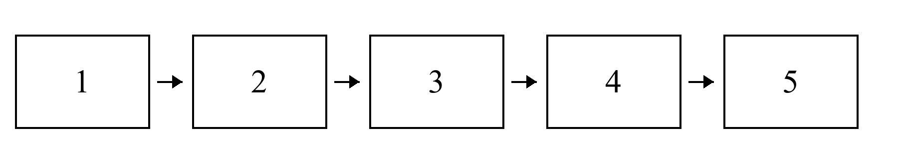

# Вычислительные модели нейронных систем в нейроинженерии: источники ограничений, данные и валидация

## Аннотация

Вычислительные модели нейронных систем используются при разработке нейроинтерфейсов и интерпретации биомедицинских сигналов. Их сопоставление затруднено различиями между моделируемым объектом, доступными наблюдениями и назначением проверки. Цель обзора — предложить схему сопоставления, связывающую ограничения модели, исходные данные и допустимую интерпретацию результата. Выполнен критический нарративный обзор с повторной оценкой исходной подборки и ограниченным тематическим дополнением литературы. Рассмотрены биофизические и коннектомно-ограниченные модели, способы идентификации параметров, проверка вычислительных реализаций и применение синтетических данных. Электрофизиология, модели Drosophila и спинальная нейростимуляция использованы как примеры разных исследовательских задач. Предложены независимые оси классификации: объект, источник ограничений, состояние модели, определение параметров, оператор наблюдения, единица проверки и допустимый вывод. Разграничены верификация, калибровка, валидация, анализ чувствительности и оценка неопределённости. Структурная идентифицируемость отделена от практической определимости параметров и наблюдаемости скрытого состояния. Сводная матрица связывает каждую включённую работу с данными настройки, наблюдением, контрольным сравнением и ограничением. Показано на рассмотренных примерах, что воспроизведение измеряемого сигнала не устанавливает однозначность внутреннего механизма, а проверка компонентов не гарантирует согласования всей системы с наблюдениями. Отдельно разобраны оценка по повторным измерениям, использование неразмеченных тестовых данных при адаптации и различие между качеством регистрации и клиническим исходом. Результатом является многоосевая схема и проверочный алгоритм для подготовки исследования. Предлагаемый алгоритм определяет необходимые вопросы, но его эффективность как самостоятельного метода ещё не оценена. Обзор не устанавливает полноту охвата области и не объединяет неоднородные показатели точности. Практическое значение состоит в согласовании измерительной задачи, данных и границ вывода при выборе вычислительной модели.

**Ключевые слова:** нейроинженерия, вычислительные модели, нейронная динамика, оператор наблюдения, исходные данные, идентифицируемость, верификация, валидация.

## Введение

В нейроинженерии вычислительная модель может объяснять формирование сигнала, оценивать параметры нервной ткани или поддерживать разработку интерфейса. Расчёт поля, возбуждения нейронов и регистрации ответа образует отдельные подзадачи [1]. Анатомические, клеточные и функциональные ограничения также относятся к разным сторонам модели [2]. Поэтому согласование одного выходного показателя не определяет достоверность всех внутренних процессов.

При выборе модели необходимо установить, какие данные и виды проверки позволяют использовать её для интерпретации биомедицинского сигнала. Обзор отвечает на три вопроса: какие ограничения задают модель; что необходимо для определения её параметров; какой тип проверки обосновывает механистический, прогностический, измерительный или клинический вывод. Цель — разработать схему сопоставления этих оснований. Рассматриваются выбранные модели динамики и измеряемых электрических ответов, а не вся вычислительная нейронаука.

## Методика обзора

Выполнен критический нарративный обзор. Исходную целевую подборку из 19 работ повторно оценили по соответствию методическим вопросам; сохранены 13, шесть исключены как избыточные предметные примеры. Исходный отбор не представлял исчерпывающего поиска. Его состав и проверенные версии сохранены отдельно от дополнения.

Дополнительный поиск выполнен 5 октября 2026 г. в PubMed и Crossref по четырём направлениям: ограничения моделей, идентифицируемость, верификация и валидация, синтетические данные и обобщение. Использованы шесть англоязычных запросов PubMed и пять запросов Crossref, включая четыре русскоязычных. Основной период — с 2015 г. по дату поиска. Примеры запросов: «neural models» с «biophysical» или «constraints»; «Observability and Structural Identifiability of Nonlinear Biological Systems»; «neural network simulation» с «verification» или «validation»; «синтетические данные электроэнцефалограмма обобщение модели». Для каждого запроса просмотрены первые 20 записей по релевантности либо вся меньшая выдача. Получены 211 записей, после удаления одного точного дубликата — 210; точные запросы, состав выдачи и решения сохранены в приложенном реестре отбора. Адресно проверены первичные DOI и страницы издателей. Такая глубина просмотра ограничивает полноту поиска.

Включались идентифицируемые первичные исследования и методические работы с проверяемым результатом, описанием модели либо определением процедуры проверки. Допускались полные тексты, авторские версии и информативные аннотации; объём доступного материала отражён в матрице. Исключались нерелевантные применения искусственных нейронных сетей, библиографические страницы без результата, дубликаты и избыточные примеры уже представленного подхода. Шесть работ добавлены из тематической выдачи; одна более ранняя работа включена как первичное основание определения практической идентифицируемости. Отобраны 20 работ. Отбор и извлечение выполнены одним составителем; независимый двойной скрининг не проводился. Для спорного вывода применено более узкое прочтение источника либо исключено соответствующее утверждение.

Извлекались объект, ограничения и состояние модели, данные настройки, оператор наблюдения, независимая единица, контроли, результат и граница вывода. Препринты рассматриваются в закреплённых версиях; публикационный статус не заменяет оценку методики. По частичным текстам не восстанавливались отсутствующие методы или результаты. Неоднородные показатели не объединялись. Итоговая классификация представляет авторский синтез, а не количественное сравнение эффективности алгоритмов.

## Результаты тематического сопоставления

### Динамика, наблюдение и идентифицируемость

В общей схеме воздействие изменяет внутреннее состояние системы, после чего оператор наблюдения преобразует его в регистрируемый сигнал (рисунок 1). Параметры динамики и измерительного канала определяются отдельно. Наблюдаемость характеризует возможность восстановления состояния по выходу; структурная идентифицируемость — определения параметров при идеальных наблюдениях и заданной структуре [3]. Практическая идентифицируемость дополнительно зависит от конечной выборки, шума и точности оценки [4]. Следовательно, совпадение расчётного сигнала с записью само по себе не идентифицирует скрытое состояние и оба набора параметров.

Рисунок 1. Связь динамики, оператора наблюдения и сигнала: 1 — воздействие; 2 — внутреннее состояние; 3 — оператор наблюдения; 4 — измеряемый сигнал; 5 — проверяемый вывод. Динамика и измерительный канал имеют собственные параметры; вывод требует соответствующего эталона. Схема предложена авторами.

Верификация устанавливает соответствие вычислительной реализации математической модели. Калибровка определяет параметры по данным настройки. Валидация сопоставляет результат с независимым эталоном для заданного применения. Работа Gutzen и соавторов показывает значение проверки сетевой активности при воспроизведении модели на другом вычислительном устройстве [5]. В отечественной методической работе рассмотрена проверка составных компьютерных моделей [6]. Это обоснования различных процедур, а не подтверждение клинической пригодности нейроинтерфейса.

Таблица 1. Независимые оси сопоставления моделей.

| Ось | Описание, подлежащее фиксации |
|---|---|
| Объект | Нейрон, сеть, популяция волокон, измерительный канал |
| Ограничения | Физические законы, анатомия, наблюдения, задача обучения |
| Состояние | Наблюдаемая величина, скрытое физическое или латентное состояние |
| Параметры | Заданы, идентифицированы, обучены, перенесены |
| Наблюдение | Регистрация, агрегирование, объёмная проводимость, преобразование признаков |
| Независимая единица | Воздействие, сеанс, животное, участник, сеть, внешняя выборка |
| Вывод | Вычислительный, механистический, прогностический, измерительный, клинический |

Оси не образуют взаимоисключающих классов: биофизическая модель может использовать коннектом, обучаемые параметры и скрытое состояние. Единица проверки указывает, от какой информации отделена оценка; новый импульс одного участника и новый участник поддерживают разные утверждения.

Таблица 2. Различаемые процедуры и свойства модели.

| Понятие | Проверяемый вопрос |
|---|---|
| Верификация | Правильно ли реализованы уравнения и численный алгоритм? |
| Калибровка | Какие параметры определены по каким данным настройки? |
| Валидация | Согласуется ли модель с независимым эталоном для заявленного применения? |
| Структурная идентифицируемость | Определимы ли параметры при идеальных наблюдениях? |
| Практическая идентифицируемость | Достаточны ли реальные данные для устойчивой оценки параметров? |
| Наблюдаемость | Можно ли восстановить скрытое состояние по выходу? |
| Чувствительность | Как параметры и предположения изменяют результат? |
| Неопределённость | Каковы пределы точности оценки и прогноза? |

Эквифинальность обозначает согласование разных механизмов или параметров с одним результатом. Она не тождественна шуму измерения. Анализ чувствительности показывает влияние вариаций, но без дополнительных условий не доказывает идентифицируемость. Эти различия важны при интерпретации параметров как характеристик ткани или нейронного процесса [3–5].

### Ограничения и функциональные наблюдения

В коннектомно-ограниченных рекуррентных сетях Beiran и Litwin-Kumar исследуют восстановление внутренней активности и параметров при доступности части нейронных наблюдений [7]. Эталон «учителя» в этой работе вычислительный. Результат показывает условия определимости в заданных сетях, но не подтверждает восстановление динамики живого организма по одному анатомическому графу.

Биофизические ограничения задают другой тип основания. В модели ноцицептивного нейрона исследованы переходы между ритмическими и пачечными разрядами при изменении тока [8]. Доступная аннотация поддерживает вывод о расчётных режимах; из неё нельзя заключить, что модель прогнозирует субъективную боль. Название биологической функции не меняет наблюдаемую величину.

Модель мозга взрослой Drosophila использована для предсказания выбранных сенсомоторных преобразований [9]. В работе по личиночному мозгу совмещены кальциевые наблюдения и электронная микроскопия [10]. Вид, стадия развития, версия графа и функциональные наблюдения должны соответствовать конкретному сравнению. Общий видовой признак не делает данные взрослого и личиночного организмов взаимозаменяемыми.

Вывод о значении структуры зависит от контролей. В закреплённой версии препринта о зрительной сети преимущество исходной топологии зависело от инициализации и характеристик контрольного графа [11]. Это ограниченный пример, не отрицание роли коннектома во всех моделях. При сопоставлении требуется отделять изменение структуры от изменения параметризации и условий обучения.

### Измерительный канал и независимость проверки

Расчёт вызванного составного потенциала действия (ECAP) объединяет поле стимуляции, возбуждение волокон и регистрацию их суммарного ответа [12]. Наблюдения при спинальной стимуляции показывают влияние позы и ширины импульса на характеристики сигнала [13]. Следовательно, расхождение расчёта и записи может относиться как к нейродинамике, так и к геометрии, регистрации или обработке.

В исследовании признаков человеческого ECAP из 15 привлечённых участников в выбранные записи вошли восемь [14]. Внешние циклы классификации выделяли каждую одиннадцатую форму сигнала, а не полностью исключённого участника. Такая оценка поддерживает вывод о работе классификатора в пределах записей; межучастническое обобщение не установлено. Случайные эффекты участника в статистической модели учитывают зависимость измерений, но не заменяют проверку на новых участниках.

Модель артефакта относится к извлечению ECAP [15]. Исследование программирующей платформы оценивает регистрацию и технические показатели; клинические исходы эффективности терапии в рассмотренных исследованиях не собирались [16]. Напротив, вторичный анализ рандомизированного исследования EVOKE включает клинические и функциональные исходы участников [17]. Эти источники иллюстрируют различные контуры доказательств. ECAP характеризует вызванный нейронный ответ; он не является прямым измерением субъективной боли. Ноцицепция, боль и результат лечения сохраняются как отдельные конструкты.

### Синтетические данные и область обобщения

При симуляционном выводе синтетические наблюдения используются для определения распределения допустимых параметров модели. Gonçalves и соавторы применяют нейронные оценки плотности к моделям нейродинамики [18]. Такой результат связан с предположениями симулятора, априорным распределением и представлением наблюдений; он не гарантирует единственного биологического механизма или переноса на другой измерительный канал.

Синтетическое дополнение обучающей выборки требует отдельной проверки на целевых данных. Исследование синтетической электроэнцефалографии рассматривает ухудшение оценки при добавлении примеров и отбор допустимых образцов [19]. В работе о мультимодальной оценке боли адаптация использовала полный массив неразмеченных реальных данных во всех разбиениях, включая данные тестовых участников; авторы отмечают возможное оптимистическое смещение [20]. Полностью внешней независимой выборки в этой оценке нет. Это трансдуктивный режим адаптации, который нельзя представлять как обучение без доступа к тестовой популяции. Различия целевых конструктов наборов также ограничивают общую интерпретацию.

### Матрица рассмотренных работ

Таблица 3 объединяет источники и основания их использования. Ж — журнальная публикация; Пр — препринт; П — полный текст; А — аннотация; Ф — проверенные разделы; Ав — авторская версия. Для [2, 3] прочитаны авторские версии, публикационные сведения сверены с журнальными записями. Для [10] закреплена bioRxiv v3 от 3 августа 2026 г.; для [11] — arXiv v1 от 5 апреля 2026 г. Знак «—» обозначает неприменимость поля к методическому обзору, а «не установлено» — отсутствие основания в доступном материале. Подробные версии и локаторы сохранены в доказательном реестре.

Таблица 3. Модели, наблюдения, проверка и границы вывода всех включённых работ.

| Работа; статус, текст | Модель; данные настройки | Наблюдение; независимая единица | Контроль; результат | Ограничение |
|---|---|---|---|---|
| [1]; Ж, Ф | Обзор нейроинтерфейсов; — | Поле, возбуждение, регистрация; — | Сопоставление компонентов | Собственная пациентская проверка не представлена |
| [2]; Ж, Ав | Обзор ограничений сетей; — | Когнитивные функции; — | Классификация биологических ограничений | Разнородные основания; нет общего показателя |
| [3]; Ж, Ав | Анализ нелинейных систем; заданные уравнения | Выход; теоретическая система | Наблюдаемость и определимость параметров | Идеальные наблюдения; конкретная структура |
| [4]; Ж, А | Профиль правдоподобия; данные настройки | Частично наблюдаемая динамика; — | Различение двух видов идентифицируемости | Биологические реакционные сети; частичный текст |
| [5]; Ж, П | Импульсная сеть; заданная конфигурация | Сетевая активность; повтор симуляции | Эталонная реализация против SpiNNaker | Совпадение реализаций не подтверждает биологию |
| [6]; Ж, А | Методика составных моделей; — | Расчёт и эталон; компонент, система | Схема верификации и валидации | Нейронная и клиническая проверка не установлены |
| [7]; Ж, П | Рекуррентная сеть; выход и часть состояний «учителя» | Активность; вычислительная сеть | Восстановление скрытых переменных | «Учитель» симулирован; эталон не биологический |
| [8]; Ж, А | Модель мембраны; внешний ток | Режим разрядов; расчётная система | Анализ переходов активности | Нет основания для прогноза боли |
| [9]; Ж, П | Коннектомная сеть; фиксированные правила | Сенсомоторные ответы; проверенное воздействие | Предсказание выбранных преобразований | Проверка функций не охватывает всю динамику |
| [10]; Пр, П | Личиночная сеть; коннектом и знаки связей | Кальциевые ответы; выбранные нейроны | Сопоставление активности и связности | Версия препринта; личиночная стадия |
| [11]; Пр, П | Зрительная сеть; обучение на стимуле | Направление движения; условия графа | Инициализация и перестроенные графы | Частная задача; предварительный результат |
| [12]; Ж, А | Поле и модели аксонов; заданная геометрия | Расчётный ECAP; — | Моделирование регистрируемого ответа | Детали независимой проверки недоступны |
| [13]; Ж, П | Физическая интерпретация; записи ECAP | Сигнал; поза и ширина импульса | Изменения регистрации и рекрутирования | Проверенные измерительные условия |
| [14]; Ж, П | Признаки и классификатор; записи восьми участников | ECAP; форма сигнала | Вложенная оценка классификации | Не выделены полностью новые участники |
| [15]; Ж, П | Модель артефакта; зарегистрированные сигналы | Выделенный ECAP; исследованные записи | Сопоставление извлечения ответа | Технический результат, не лечение |
| [16]; Ж, П | Фильтр и программирование; записи исследований | ECAP; сравнение режимов | Качество регистрации и программирования | Исходы эффективности не собирались |
| [17]; Ж, А | Клиническое сравнение; рандомизация | Исходы лечения; участник | Замкнутая против разомкнутой стимуляции | Вторичный анализ; аннотация |
| [18]; Ж, П | Оценка плотности; симуляционные выборки | Распределение параметров; модель и наблюдение | Сопоставление допустимых параметров | Зависимость от симулятора и априорных условий |
| [19]; Ж, П | Генерация ЭЭГ; обучающие данные | Классификация; новый участник | Дополнение с отбором и без него | Принятая неотредактированная версия; выбранные задачи |
| [20]; Ж, П | Синтетическое обучение; реальные данные адаптации | Оценка боли; участнические разбиения | Сопоставление доменов и компонентов | Тестовые участники участвовали в адаптации |

## Обсуждение

Авторская схема объединяет сведения, которые в предметных работах рассматриваются раздельно. Её результат — соответствие между ограничениями, наблюдением, независимой единицей и разрешённой интерпретацией. Она не вводит новый нейронный алгоритм и не ранжирует модели по несопоставимым показателям.

Контуры проверки выбираются по назначению и могут выполняться итеративно (таблица 4). Они не образуют обязательной лестницы: межучастническая прогностическая оценка может не объяснять механизм, а клиническое сравнение не устанавливает истинность внутренних состояний вычислительной модели. Согласование компонентов важно, но сетевые свойства требуют самостоятельного эталона [5, 6].

Таблица 4. Контуры проверки и допустимые выводы.

| Контур | Сравнение | Граница вывода |
|---|---|---|
| Вычислительный | Уравнения, численные эталоны, альтернативная реализация | Корректность реализации в заданном режиме |
| Механистический | Наблюдения, различающие альтернативные процессы | Соответствие проверенных механизмов |
| Измерительный | Сигнал при заданной геометрии и обработке | Точность наблюдаемого ответа |
| Прогностический | Независимая единица, заданный объём калибровки | Обобщение в проверенной популяции |
| Клинический | Сопоставимые участники, исходы и сроки | Результат конкретного клинического исследования |

Практический проверочный алгоритм предлагается как последовательность вопросов при подготовке исследования: определить целевую величину и объект; перечислить ограничения; отделить заданные параметры от оцениваемых; описать оператор наблюдения; указать данные настройки и полностью отделённую единицу проверки; выбрать альтернативные модели; оценить чувствительность и неопределённость; сформулировать допустимый вывод. Неполнота любого ответа указывает на необходимое уточнение постановки, а не автоматически на непригодность модели.

Открыты вопросы достаточности функциональных наблюдений при заданной структуре, разделения неопределённости ткани и измерительного канала, а также переноса синтетического обучения за пределы генератора. Их решения зависят от задачи и доступного эталона. Модели Drosophila и ECAP здесь иллюстрируют общую методику; обзор не обосновывает конкретную схему межвидового переноса.

Ограничения обусловлены целевым исходным отбором, просмотром ограниченной выдачи, одним составителем, частичной доступностью текстов и двумя препринтами. Русскоязычные запросы Crossref дали преимущественно непрофильные результаты; две отечественные работы представляют частные примеры, а не охват национальной литературы. Выводы по аннотациям ограничены заявленными результатами. Сам проверочный алгоритм требует будущей независимой оценки полезности.

## Заключение

Сопоставлять вычислительные модели нейронных систем следует по независимым осям, связывающим объект и ограничения с наблюдаемым сигналом и единицей проверки. Верификация, калибровка и валидация решают разные задачи. Определимость внутренних параметров требует самостоятельного анализа; воспроизведение выхода не заменяет его.

Предложенная схема и проверочный алгоритм позволяют явно обозначить необходимые данные и границу результата при разработке нейроинтерфейса. Вычислительная, измерительная и клиническая интерпретации опираются на соответствующие эталоны. Применимость выводов сохраняется в пределах рассмотренных моделей и условий проверки.

## Extended abstract

### Computational models of neural systems in neuroengineering: sources of constraints, data and validation

**Problem and objective.** Computational models support neural interface development and interpretation of biomedical signals. Similar prediction accuracy can conceal different assumptions about biological mechanisms and measurement. This critical narrative review proposes a comparative framework connecting model constraints, input data, observation operators, independent evaluation units and admissible conclusions. Neural dynamics and evoked electrical responses provide illustrative applications rather than an exhaustive account of computational neuroscience.

**Materials and methods.** An initial purposeful collection of nineteen publications was reassessed; thirteen were retained and six redundant application examples were excluded. A bounded supplementary search was conducted on 5 October 2026 using six English PubMed queries and five Crossref queries, including four Russian queries. The main interval was 2015 to the search date. The first twenty records by relevance, or the entire smaller result set, were inspected for each query, yielding 211 records. Six publications were added from these searches and one earlier contribution supplied a foundational definition of practical identifiability. Twenty works were included. Exact queries, screening decisions, publication versions and primary evidence locators were recorded separately. Selection and extraction were performed by one compiler without independent duplicate screening. Available abstracts and author manuscripts were identified explicitly; heterogeneous numerical results were not pooled.

**Results.** The proposed independent axes describe the modelled object, sources of constraints, internal state, parameter determination, observation operator, independent unit and permissible interpretation. Verification concerns implementation of the mathematical model, calibration determines parameters from fitting data, and validation addresses agreement with an independent reference for an intended use. Structural identifiability, practical parameter estimation and state observability are distinct properties. A common conceptual scheme links stimulation, internal dynamics, measurement and the resulting claim. The source matrix records the model, fitting observations, evaluation unit, controls, findings and limitations for every included publication. Connectome examples demonstrate why anatomical restrictions and task performance do not uniquely identify internal activity. The ECAP examples distinguish waveform-based assessment from evaluation on completely unseen participants, and recording fidelity from treatment efficacy. Synthetic inference is conditional on the simulator and its prior assumptions. Adaptation using unlabelled test participants must be reported as transductive access rather than absence of test-population information.

**Discussion and conclusions.** Verification, mechanistic, measurement, predictive and clinical checks are complementary domains, not obligatory consecutive stages. The author contribution is a multi-axis comparison framework and a question-based checking algorithm for study preparation. Its utility has not yet been independently evaluated. The review does not establish superiority of a new neural algorithm or justify a particular cross-species transfer architecture. Neural activity, animal nociception, human subjective pain and clinical outcomes remain separate constructs. Restricted screening depth, partial texts, a single compiler and preliminary publications limit the conclusions.

**Keywords:** neuroengineering, computational models, neural dynamics, observation operator, input data, identifiability, verification, validation.
